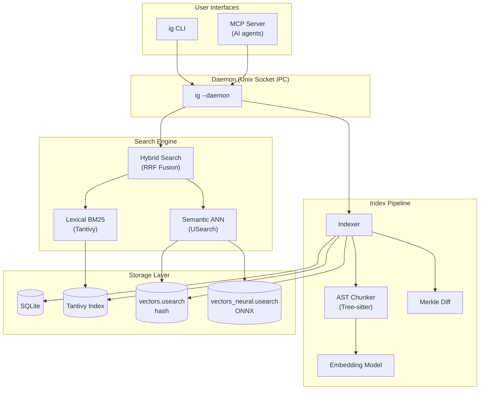
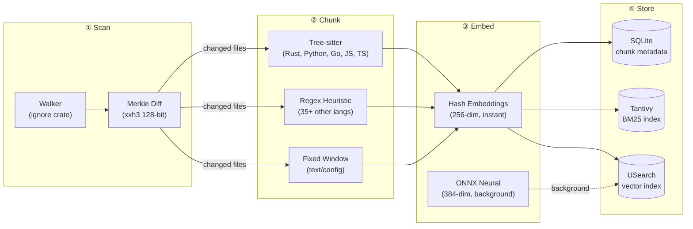
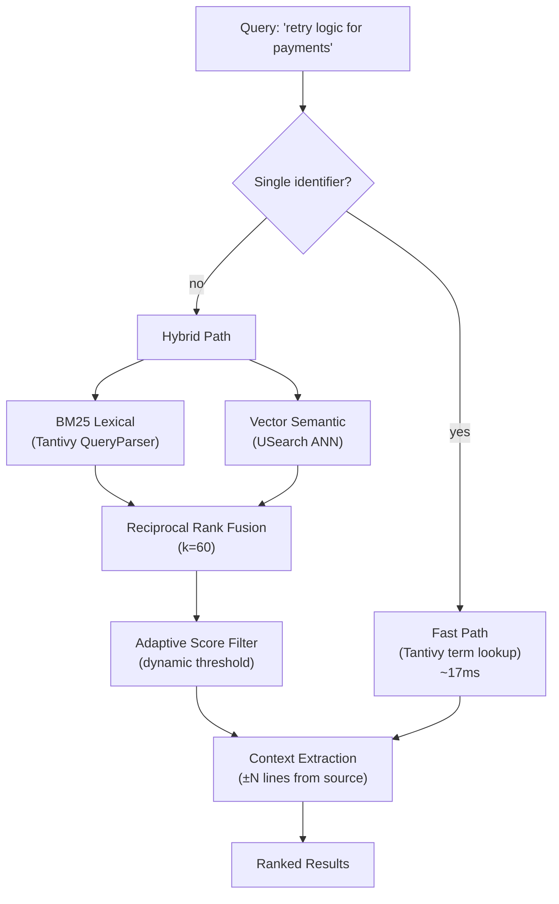
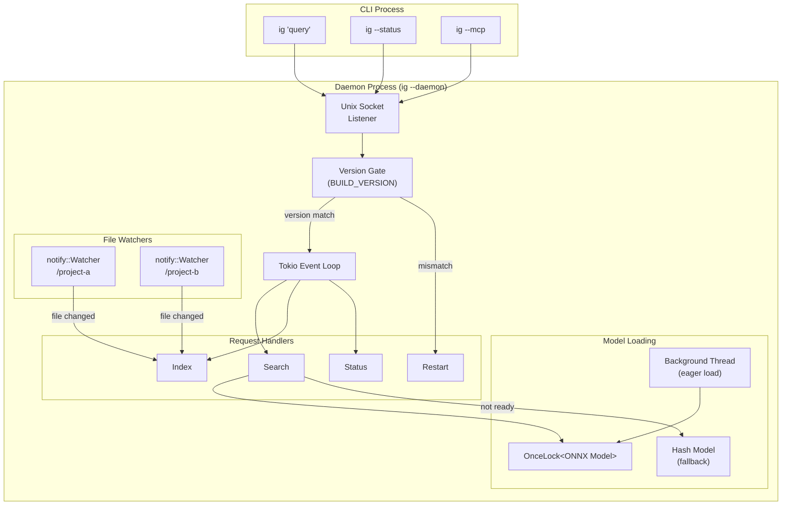
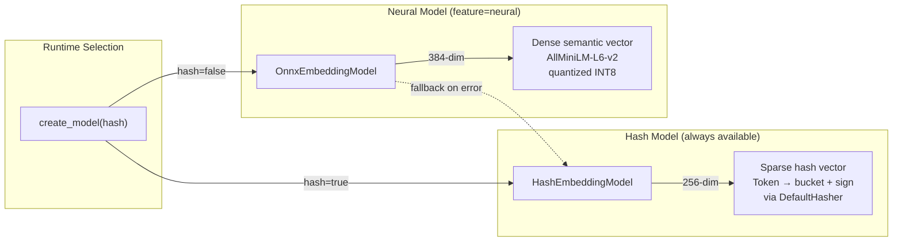
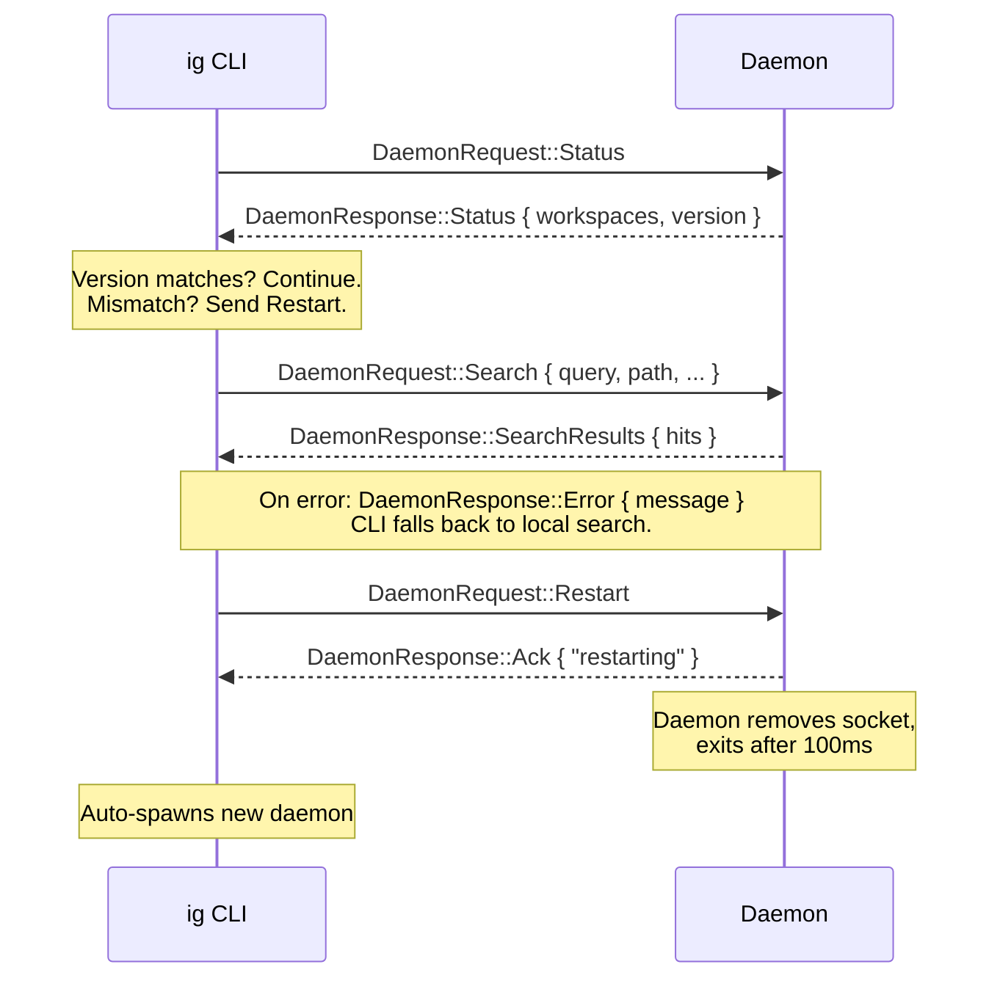
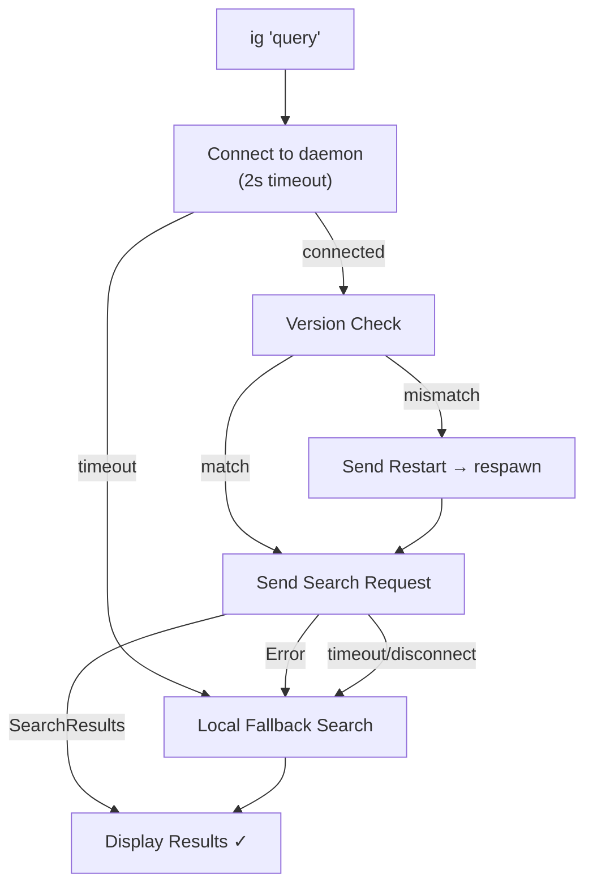

# Architecture

> A deep dive into how ivygrep turns natural-language queries into
> instant, relevant code results — entirely offline.

---

## High-Level Overview

ivygrep is a **local-first semantic code search engine** built in Rust. It
combines full-text lexical search with vector similarity search, backed by an
always-on background daemon that keeps indexes fresh.



---

## Module Map

The codebase is a single Rust crate with 16 modules. Each has a clear
responsibility:

| Module | File | Lines | Purpose |
|--------|------|------:|---------|
| **cli** | `cli.rs` | ~1000 | CLI argument parsing, search orchestration, output formatting |
| **daemon** | `daemon.rs` | ~530 | Background daemon: IPC server, file watcher, multi-workspace search routing |
| **protocol** | `protocol.rs` | ~120 | Shared IPC types (`DaemonRequest`, `DaemonResponse`), version constant |
| **search** | `search.rs` | ~1100 | Hybrid search engine: BM25 + vector fusion, scoring, context extraction |
| **indexer** | `indexer.rs` | ~900 | Index pipeline: Merkle diff → chunk → embed → write to SQLite/Tantivy/USearch |
| **chunking** | `chunking.rs` | ~1400 | AST-aware code splitting (Tree-sitter + regex fallback), 44 language registry |
| **embedding** | `embedding.rs` | ~400 | Embedding trait + two backends: hash (instant) and ONNX neural (high quality) |
| **vector_store** | `vector_store.rs` | ~190 | USearch wrapper: cosine similarity index with mmap'd read-only search |
| **merkle** | `merkle.rs` | ~270 | Merkle-style fingerprinting for incremental indexing (xxh3 128-bit) |
| **workspace** | `workspace.rs` | ~520 | Workspace discovery, metadata, scope resolution, status reporting |
| **regex_search** | `regex_search.rs` | ~140 | Regex mode (`--regex`) using `grep-searcher` + `grep-regex` |
| **mcp** | `mcp.rs` | ~650 | MCP (Model Context Protocol) server for AI coding agents |
| **config** | `config.rs` | ~50 | Paths: `IVYGREP_HOME`, socket, indexes, models |
| **walker** | `walker.rs` | ~25 | `.gitignore`-aware directory walker (via `ignore` crate) |
| **text** | `text.rs` | ~90 | Token utilities: identifier splitting, singularization |
| **path_glob** | `path_glob.rs` | ~50 | Include/exclude glob matching for search filtering |

---

## Core Data Flow

### 1. Indexing Pipeline

When a workspace is indexed (first search, `--add`, or file watcher trigger),
the pipeline processes files through four stages:



**Key design decisions:**

- **Merkle fingerprints** use file path + size + mtime hashed with xxh3 (128-bit
  SIMD). Re-indexing an unchanged 92K-file repo takes ~10ms.
- **Tree-sitter** provides exact AST boundaries for 5 core languages (Rust,
  Python, Go, JavaScript, TypeScript). Other languages fall back to regex-based
  signature detection.
- **Two-tier embeddings**: hash embeddings are computed inline (instant), neural
  ONNX embeddings are computed asynchronously by a background subprocess
  (`--enhance-internal`), so indexing never blocks on model inference.

### 2. Search Pipeline

Every search query flows through a hybrid fusion pipeline:



**Key design decisions:**

- **Identifier fast path**: Single tokens like `kfree` or `handleTimeout`
  bypass vector search entirely and go straight to Tantivy term lookup (~17ms
  on the Linux kernel).
- **RRF fusion** (Reciprocal Rank Fusion, k=60) merges lexical and semantic
  rankings without requiring score calibration — each result's combined score
  is `1/(k + rank_lexical) + 1/(k + rank_semantic)`.
- **Adaptive filtering** dynamically computes a score threshold based on result
  distribution, preventing noise from drowning real matches on large corpora.
- **Pre-filtering**: `--type`, `--include`, `--exclude` are pushed down into
  Tantivy `BooleanQuery` and SQLite `LIKE` before vector search runs, avoiding
  full-corpus scanning on million-chunk repos.

### 3. Daemon Architecture

The daemon provides persistent search routing, file watching, and shared model
loading across all CLI invocations:



**Key design decisions:**

- **Auto-spawn**: The first `ig` invocation auto-spawns the daemon in
  the background. No manual startup needed.
- **Version-gated restart**: Each daemon response includes `BUILD_VERSION`.
  On mismatch (e.g., after `brew upgrade`), the CLI sends a `Restart`
  request over the socket — the daemon exits cleanly, and the CLI
  auto-spawns the new version.
- **Non-blocking model load**: The ONNX model loads eagerly in a background
  `std::thread`. Searches that arrive before loading completes use hash
  embeddings as an instant fallback.
- **Connection timeouts**: Socket connect and write operations have a 2-second
  timeout to prevent the CLI from hanging on a zombie daemon.
- **Local fallback**: If the daemon returns an error or is unreachable, the CLI
  transparently retries the search locally.

---

## Storage Layout

Each indexed workspace gets its own directory under the ivygrep home:

```
~/.local/share/ivygrep/
├── daemon.log                          # Daemon stderr output
├── daemon.sock                         # Unix domain socket (IPC)
├── models/                             # ONNX model cache (~23 MB)
│   └── AllMiniLML6V2Q/
└── indexes/
    └── <workspace-id>/                 # hex(xxh3(canonical_path))
        ├── workspace.json              # Workspace metadata
        ├── merkle.json                 # File fingerprint snapshot
        ├── chunks.db                   # SQLite — chunk text + metadata
        ├── tantivy/                    # Tantivy BM25 index segments
        │   ├── meta.json
        │   └── *.fast / *.pos / ...
        ├── vectors.usearch             # Hash-based vector index (always present)
        ├── vectors_neural.usearch      # Neural ONNX vector index (background)
        ├── .enhancing.pid              # PID of active neural enhancement subprocess
        └── .watcher.pid                # PID of daemon watcher for this workspace
```

| Store | Engine | Role |
|-------|--------|------|
| `chunks.db` | SQLite 3 (rusqlite, bundled) | Chunk text, metadata, file paths, content hashes. Source of truth for all chunk data. |
| `tantivy/` | Tantivy 0.26 | Full-text BM25 index with per-field boosting (file_path: 2×). Supports term queries and boolean combinations. |
| `vectors.usearch` | USearch 2.24 | Cosine similarity index for hash-based embeddings (256-dim). Always present, instant to build. |
| `vectors_neural.usearch` | USearch 2.24 | Cosine similarity index for ONNX neural embeddings (384-dim, AllMiniLM-L6-v2 quantized). Built asynchronously in background. |
| `merkle.json` | Custom (serde_json) | BTreeMap of `relative_path → xxh3(path+size+mtime)`. Used for O(n) incremental diff. |

---

## Embedding Models

ivygrep supports two embedding backends, selected at runtime:



| Property | Hash Model | Neural Model |
|----------|-----------|--------------|
| Dimensions | 256 | 384 |
| Quality | Moderate (token overlap) | High (true semantic similarity) |
| Latency | Instant | ~23MB model download on first use |
| Hardware | CPU only | CoreML (Apple Neural Engine) on macOS, CPU elsewhere |
| Batch support | Parallel via rayon | Native ONNX batching |
| Feature gate | Always | `neural` (default) |

The hash model works by:
1. Splitting text into tokens
2. Expanding each token into semantic variants (e.g., `calculateTax` → `["calculate", "tax", "calculatetax"]`)
3. Applying singularization (`taxes` → `tax`) and normalization aliases (`calc` → `calculate`)
4. Hashing each token to a bucket in a fixed-size vector with sign randomization
5. L2-normalizing the result

---

## IPC Protocol

The CLI and daemon communicate over a Unix domain socket using newline-delimited
JSON. The protocol is defined in `protocol.rs`:



### Request Types

| Request | Fields | Description |
|---------|--------|-------------|
| `Status` | — | Health check, returns workspace list + daemon version |
| `Search` | query, path?, limit?, context?, type_filter?, include/exclude globs, scope | Hybrid semantic+lexical search |
| `RegexSearch` | pattern, path?, limit?, include/exclude globs, scope | Regex-only search (like ripgrep) |
| `Index` | path, watch | Index a workspace and optionally start watching |
| `Remove` | path | Remove workspace index |
| `Restart` | — | Graceful shutdown (daemon cleans up and exits) |

### Response Types

| Response | Fields | Description |
|----------|--------|-------------|
| `Status` | workspaces: Vec\<WorkspaceStatus\>, version: Option\<String\> | Workspace health + daemon build version |
| `SearchResults` | hits: Vec\<SearchHit\> | Ranked search results with file, lines, score, context |
| `Ack` | message: String | Success confirmation |
| `Error` | message: String | Error with description |

---

## Resilience Model

The system is designed to **never silently fail**. If something breaks,
the user still gets results:



| Failure Mode | Behavior |
|-------------|----------|
| Daemon not running | Auto-spawn on first request |
| Daemon version mismatch | Protocol-based restart (`DaemonRequest::Restart`) |
| Daemon search error | CLI falls back to local `hybrid_search` |
| Daemon zombie/unreachable | 2s connect timeout → remove stale socket → local fallback |
| ONNX model not loaded yet | Hash model used as instant fallback |
| ONNX model fails to load | Automatic fallback to hash model |
| All searches return empty | User hint: check `daemon.log` or `--add . --force` |

---

## Dependencies

| Crate | Version | Role |
|-------|---------|------|
| `tantivy` | 0.26 | Full-text BM25 search index |
| `usearch` | 2.24 | Approximate nearest-neighbor vector index |
| `rusqlite` | 0.39 (bundled) | Chunk metadata store |
| `fastembed` | 5 | ONNX embedding model loading (AllMiniLM-L6-v2) |
| `ort` | 2.0.0-rc.11 | ONNX Runtime (CoreML on macOS) |
| `tree-sitter` | 0.26 | AST parsing for precise code chunking |
| `notify` | 8.2 | Cross-platform filesystem watcher |
| `tokio` | 1.50 | Async runtime for daemon event loop |
| `rayon` | 1.10 | Parallel indexing and batch embedding |
| `clap` | 4.6 | CLI argument parsing |
| `xxhash-rust` | 0.8 | 128-bit SIMD hashing for Merkle fingerprints |
| `ignore` | 0.4 | `.gitignore`-aware directory walking |
| `serde` / `serde_json` | 1.0 | Serialization for IPC protocol and storage |

---

## Build Variants

| Feature | Default | Effect |
|---------|---------|--------|
| `neural` | ✅ | Enables ONNX neural embeddings (fastembed + ort). Adds ~23MB model download. |
| *(none)* | — | Hash-only mode. Smaller binary, no ONNX download, lower search quality. |

```bash
# Full build (default — includes ONNX neural embeddings)
cargo build --release

# Minimal build (hash embeddings only, no model download)
cargo build --release --no-default-features
```

On macOS, the `neural` feature automatically links CoreML for GPU/ANE
acceleration. On Linux, ONNX runs on CPU.
