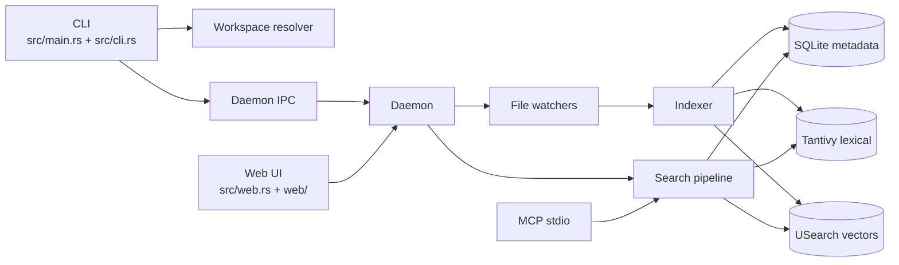
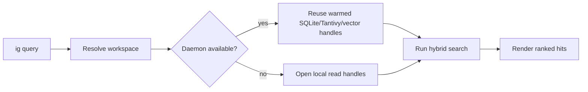
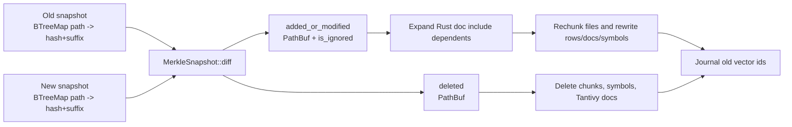
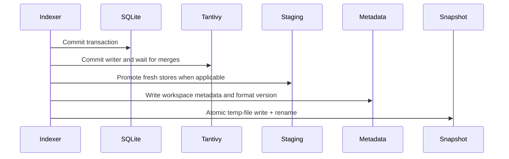
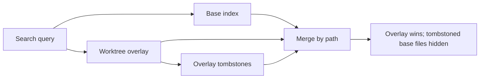
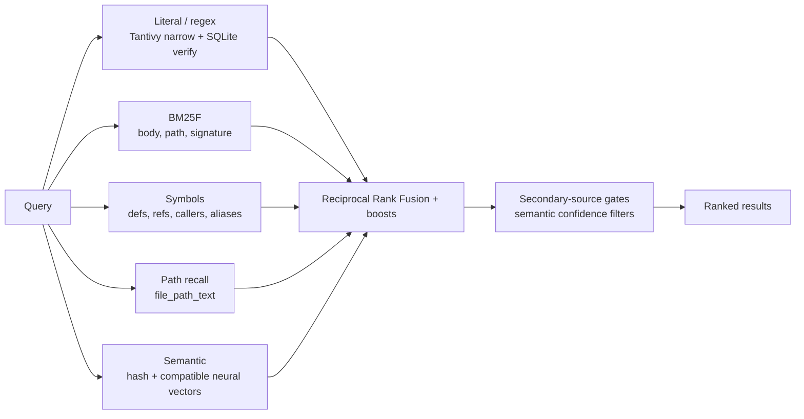

# Architecture

ivygrep is local code search. It builds a lexical index first, then adds vector
stores in the background. Search stays local: source code, queries, embeddings,
SQLite data, Tantivy data, and USearch vectors stay on the machine.

This document follows current source modules and behavior. Module names below
match the source tree.

## Code Map

| Area | Main files | Role |
|---|---|---|
| CLI | `src/cli.rs`, `src/main.rs` | Parse flags, resolve workspaces, talk to daemon, print results |
| Workspace metadata | `src/workspace.rs`, `src/config.rs` | Index paths, workspace ids, health checks, format versioning |
| File walk and diffs | `src/walker.rs`, `src/merkle.rs` | Respect ignore rules, fingerprint files, compute incremental changes |
| Indexing | `src/indexer.rs`, `src/chunking.rs` | Chunk source, write SQLite/Tantivy/vector stores, stage fresh indexes |
| Search | `src/search.rs`, `src/symbols.rs`, `src/reranker.rs` | Build candidates, fuse ranks, filter low-quality hits |
| Context graph | `src/context.rs`, `src/context_graph.rs` | Build budgeted task packs from retrieval, typed file edges, symbols, and Git history |
| Embeddings | `src/embedding.rs`, `src/vector.rs` | Hash embeddings, learned profiles, USearch storage |
| Daemon | `src/daemon.rs`, `src/ipc.rs`, `src/protocol.rs` | Watchers, warm search contexts, query cache, IPC protocol |
| Web UI | `src/web.rs`, `web/` | Daemon-backed local HTTP UI, embedded frontend assets |
| MCP | `src/mcp.rs` | Stdio MCP tools for coding agents |


```mermaid
flowchart LR
    CLI["CLI<br/>src/main.rs + src/cli.rs"] --> Workspace["Workspace resolver"]
    CLI --> IPC["Daemon IPC"]
    IPC --> Daemon["Daemon"]
    Daemon --> Search["Search pipeline"]
    Daemon --> Watchers["File watchers"]
    Watchers --> Indexer["Indexer"]
    Web["Web UI<br/>src/web.rs + web/"] --> Daemon
    MCP["MCP stdio"] --> Search
    Indexer --> SQLite[("SQLite metadata")]
    Indexer --> Tantivy[("Tantivy lexical")]
    Indexer --> Vectors[("USearch vectors")]
    Search --> SQLite
    Search --> Tantivy
    Search --> Vectors
```

## Runtime Shape

Foreground CLI calls do as little work as possible:


```mermaid
flowchart LR
    Query["ig query"] --> Resolve["Resolve workspace"]
    Resolve --> Route{"Daemon available?"}
    Route -- "yes" --> Warm["Reuse warmed SQLite/Tantivy/vector handles"]
    Route -- "no" --> Local["Open local read handles"]
    Warm --> Hybrid["Run hybrid search"]
    Local --> Hybrid
    Hybrid --> Render["Render ranked hits"]
```

Indexing publishes in stages:


```mermaid
flowchart LR
    Resolve["Resolve workspace"] --> Lock["Acquire index lock"]
    Lock --> Health["Health and format check"]
    Health --> Snapshot["Build or refresh Merkle-style snapshot"]
    Snapshot --> Diff["Diff old snapshot against new snapshot"]
    Diff --> Chunk["Chunk changed files"]
    Chunk --> Write["Write SQLite and Tantivy"]
    Write --> Commit["Commit lexical stores"]
    Commit --> Save["Save snapshot and metadata generation"]
    Save --> Enhance["Build hash and neural vectors in background"]
```

The design goal is quick usable search, then better semantic recall after
background enhancement. BM25, literal, path, and symbol search work after the
lexical commit. Hash and neural vector stores catch up by generation.

## Workspace Identity and Storage

`Workspace::resolve` canonicalizes the workspace root and derives the index id
with `xxh3_128(canonical_root_path)`. The id is hex-encoded from the little-endian
digest bytes. All workspace-specific state lives under:

```text
${XDG_DATA_HOME:-~/.local/share}/ivygrep/indexes/<workspace-id>/
```

Important files:

```text
workspace.json
index.lock
index_format_version
metadata.sqlite3
tantivy/
vectors.usearch
vectors_neural.usearch
neural_model.json
neural_profile
neural_backend
merkle_snapshot.json
indexed_git_state
base_ref.json
overlay.sqlite3
overlay_tantivy/
overlay_vectors.usearch
.hash_tombstones
.hash_tombstones.processing
.hash_enhanced_generation
.neural_tombstones
.neural_tombstones.processing
.neural_enhanced_generation
.indexing.pid
.indexing.progress
.enhancing.pid
.enhancing.phase
.enhancing.progress
.watcher.pid
```

Current on-disk search format is `INDEX_FORMAT_VERSION = 18`. Health checks
rebuild indexes with missing stores, corrupt SQLite/Tantivy/vector files,
incompatible format versions, or stale worktree overlays.

Paths inside indexes use `workspace::index_path_string`: a workspace-relative
path rendered with `/` separators. Those strings are the shared keys used by
Merkle snapshots, SQLite rows, Tantivy terms, symbol tables, overlay tombstones,
and doc-include dependency edges.

## SQLite

SQLite stores chunk metadata, compressed source text, stats, symbols, Rust doc
include dependencies, and compact typed file edges.

Main tables:

| Table | Purpose |
|---|---|
| `chunks` | `chunk_key`, `file_path`, line range, language, kind, text bytes, `vector_key`, modified time, ignored flag |
| `_stats` | Cached `chunk_count`, `file_count`, `vector_key_count` |
| `symbols` | `WITHOUT ROWID`, primary key `(normalized_name, chunk_key)` |
| `included_file_dependencies` | `(owner_path, included_path)` edges for Rust doc includes |
| `file_edges` | `WITHOUT ROWID` dependency, test, config, and documentation edges keyed by source and target path |
| `tombstones` | Overlay-only table for base files hidden by a worktree |

The `chunks.text` column stores raw UTF-8 bytes for small chunks. Chunks at least
512 bytes are zstd-compressed only when the compressed bytes are smaller than
the original. Search reads chunk metadata without text whenever possible, then
decompresses text only for exact verification, semantic hydration, previews, or
result rendering.

Normal write connections use WAL. Fresh full-index staging uses faster pragmas
because it writes to a throwaway directory and only becomes visible after
promotion:

```sql
PRAGMA journal_mode = OFF;
PRAGMA synchronous = OFF;
PRAGMA locking_mode = EXCLUSIVE;
PRAGMA cache_size = -64000;
PRAGMA temp_store = MEMORY;
```

Secondary indexes are deferred during fresh staging, then created after bulk
insert. Search connections are read-only and tuned for mmap/page-cache-heavy
lookups.

## Context Graph

Indexing extracts local imports plus test, manifest, and Markdown-link
relationships from full files. `file_edges` stores paths and edge type only.
No symbol-level call graph is duplicated.

`ig context` and MCP `output=context_pack` start from task-matching primary
hits, expand typed edges in both directions, rank bounded neighbors, then
hydrate one task-relevant chunk per file. Recent Git co-changes are queried only
when static edges provide insufficient coverage. Weak config and documentation
neighbors require task overlap. Final assembly balances roles, deduplicates
overlapping snippets, and enforces complete-pack token budget.

## Tantivy

Tantivy provides lexical candidate retrieval. SQLite remains the source of truth
for stored source text.

Schema:

| Field | Use |
|---|---|
| `vector_key` | Stored id shared with SQLite and vector stores |
| `file_path` | Exact stored string, used for path filters and deletes |
| `start_line`, `end_line` | Stored result bounds |
| `language`, `kind` | Stored filters and ranking signals |
| `text` | Code-tokenized BM25 body indexed with frequencies; SQLite stores source text |
| `is_ignored` | Stored ignored-file flag |
| `file_path_text` | Tokenized path BM25F field |
| `signature` | Tokenized definition signature BM25F field |

The main text field stores frequencies without positions. Exact phrase and
literal verification reads decompressed SQLite text instead of relying on
Tantivy positions.

## Vector Stores

USearch stores approximate-nearest-neighbor vectors:

| Store | Contents |
|---|---|
| `vectors.usearch` | 256-dimensional hash embeddings, F16 |
| `vectors_neural.usearch` | Learned embeddings, profile-dependent dimensions, F16 |
| `overlay_vectors.usearch` | Worktree overlay hash embeddings only |

`vector_key_for_chunk` hashes:

```text
index_path_string(file_path)
start_line as little-endian usize bytes
end_line as little-endian usize bytes
chunk content_hash
```

It uses `xxh3_128`, takes the first 8 little-endian digest bytes, and masks the
top bit so the value fits SQLite signed integer storage. Including path and line
bounds keeps identical boilerplate in different files from sharing an id.

`Chunk.content_hash` itself is `xxh3_128` over:

```text
relative path bytes
start line bytes
end line bytes
chunk text bytes
```

Those keys are stable for unchanged chunks, so background vector jobs can resume
and skip rows already present in a vector store.

## Merkle-Style Change Detection

`src/merkle.rs` stores a flat Merkle-style snapshot. No nested tree nodes are
stored. The snapshot is:

```rust
pub struct MerkleSnapshot {
    pub root_hash: String,
    pub files: BTreeMap<String, String>,
}
```

### Snapshot Keys

`files` keys are canonical workspace-relative index paths:

```text
src/search.rs
web/src/main.ts
README.md
```

The key is produced by `index_path_string`, so path separators are normalized to
`/`. The path participates in the snapshot root hash. It does not participate in
the per-file metadata fingerprint because the map key already carries it.

### Snapshot Values

For normal indexing, each value is:

```text
metadata_hash + visibility_suffix
```

`metadata_hash` is `xxh3_128` over:

```text
file size
mtime seconds
mtime nanoseconds
ctime seconds      # Unix only
ctime nanoseconds  # Unix only
```

Suffix meanings:

| Suffix | Meaning |
|---|---|
| `-0` | File is index-visible under normal ignore rules |
| `-1` | File exists but would be ignored when `skip_gitignore` is true |

Normal indexing respects ignore rules and stores only visible files, so values
end in `-0`. When `skip_gitignore` is true, ivygrep first walks with ignore
rules enabled to learn which paths would be visible, then walks with ignore
rules disabled and marks ignored paths with `-1`. This lets later search and
overlay logic know whether a file was indexed because the caller opted out of
ignore filtering.

Files over `16 MiB` are excluded from Merkle snapshots. Binary files can appear
in the snapshot if the walker includes them; chunking later decides whether a
file produces indexable text chunks. Keeping binary metadata in the snapshot
lets ivygrep notice changes that can affect overlay/deletion behavior.

### Root Hash

`root_hash` is `xxh3_128` over sorted `(path, value)` pairs from the `BTreeMap`:

```text
path bytes
value bytes
path bytes
value bytes
...
```

Equal root hashes mean no path or fingerprint in the snapshot changed, so
incremental indexing can return without reading or chunking files.

### Full Diff

`MerkleSnapshot::diff(old, new)` compares both maps:

| Case | Output |
|---|---|
| Path missing from old, present in new | `added_or_modified` |
| Path present in both but value changed | `added_or_modified` |
| Path present in old, missing from new | `deleted` |

Each `added_or_modified` entry carries `(PathBuf, is_ignored)`, where
`is_ignored` is read from the `-1` suffix. Deleted entries only need the path.

The indexer recomputes only files in `added_or_modified`, plus extra owners
found through `included_file_dependencies`. Deleted files remove persisted chunks
and append vector tombstones.


```mermaid
flowchart LR
    Old["Old snapshot<br/>BTreeMap path -> hash+suffix"] --> Diff["MerkleSnapshot::diff"]
    New["New snapshot<br/>BTreeMap path -> hash+suffix"] --> Diff
    Diff --> Changed["added_or_modified<br/>PathBuf + is_ignored"]
    Diff --> Deleted["deleted<br/>PathBuf"]
    Changed --> Dependents["Expand Rust doc include dependents"]
    Dependents --> Rechunk["Rechunk files and rewrite rows/docs/symbols"]
    Deleted --> Remove["Delete chunks, symbols, Tantivy docs"]
    Rechunk --> Tombstones["Journal old vector ids"]
    Remove --> Tombstones
```

### Targeted Watcher Refresh

Daemon watchers send changed relative paths into
`MerkleSnapshot::refresh_paths`. This updates a loaded snapshot without walking
the whole repository when the change is safe and local.

Refresh succeeds for:

- Existing files already present in the snapshot.
- Deleted file entries already present in the snapshot.

Refresh falls back to a full Merkle scan for:

- `skip_gitignore = true`, because ignored/visible classification can change.
- Empty relative paths.
- `.gitignore` or `.ignore`, because many files can change visibility.
- Directories, because children can change.
- New files not already in the snapshot, because ignore classification may need
  a proper walk.
- Deleted paths that were directory prefixes in the old snapshot.

For existing files, refresh recomputes the metadata hash and preserves the old
visibility suffix. For deleted files, it removes the path from the map. It then
recomputes `root_hash`.

### Content-Based Snapshots

`MerkleSnapshot::build_content_based` uses file contents instead of metadata.
It is used for initial Git worktree overlay construction, where two worktrees
can have identical bytes with different mtimes.

Content-based values hash:

```text
relative path bytes
normalized file content bytes
visibility suffix
```

For indexable files, CRLF is normalized before hashing. This avoids creating
overlay chunks when a worktree and its base have the same logical content but
different filesystem metadata.

Normal long-lived snapshots remain metadata-based because they are cheaper to
build and good enough for same-worktree incremental checks.

### Crash Consistency

`merkle_snapshot.json` is saved after persistent stores commit:


```mermaid
sequenceDiagram
    participant Indexer
    participant SQLite
    participant Tantivy
    participant Staging
    participant Metadata
    participant Snapshot
    Indexer->>SQLite: Commit transaction
    Indexer->>Tantivy: Commit writer and wait for merges
    Indexer->>Staging: Promote fresh stores when applicable
    Indexer->>Metadata: Write workspace metadata and format version
    Indexer->>Snapshot: Atomic temp-file write + rename
```

If the process dies before step 5, the next run sees an older snapshot and
recomputes changed files. That can do extra work, but it does not mark
uncommitted chunks as current.

Corrupt snapshot JSON loads as an empty snapshot. Snapshot IO errors still
propagate. `file_is_corrupt` lets quick health checks force a rebuild when the
snapshot file itself is broken.

## What Gets Recomputed

Indexing recomputation starts from the Merkle diff:

```text
changed paths = diff.added_or_modified
deleted paths = diff.deleted
```

Then `add_included_file_dependents` expands changed paths. It queries
`included_file_dependencies` from the current SQLite store, overlay SQLite, and
base SQLite when present. If `src/lib.rs` included `README.md` in Rust docs and
`README.md` changes, `src/lib.rs` is added to `added_or_modified` so its doc
chunks refresh.

For each recomputed file:

1. Existing chunks for that path are removed.
2. Old vector keys are appended to hash/neural tombstone journals.
3. `chunk_source_with_metadata` creates structural or text chunks.
4. Rust doc includes are loaded and tracked as dependency edges.
5. New chunks are inserted into SQLite, Tantivy, and symbols. Hash and neural
   vectors are built by background enhancement from committed SQLite rows.

If a modified file now produces no chunks, incremental indexing still records an
empty `IndexedFile` so stale chunks are removed. Fresh full indexes skip empty
files because no old rows exist.

Deleted paths call `remove_file_chunks`, which deletes Tantivy docs by
`file_path`, deletes SQLite chunks and symbols, removes doc dependency edges,
and journals vector keys for later cleanup.

## Fresh Index Staging

Fresh non-overlay indexes write to `.fresh-index-staging-<pid>-<unique>/`.

Staged paths:

```text
metadata.sqlite3
tantivy/
vectors.usearch
```

Promotion removes old main stores and renames staged stores into place. The
index lock remains in the real index directory and is not promoted. The staging
directory is removed on drop if promotion did not finish.

Incremental indexing writes directly to existing stores. Worktree overlays also
write directly to overlay stores, because overlays are small deltas and need to
preserve base references.

## Git Worktree Overlays

Git worktrees avoid rebuilding a full index per branch. A linked worktree points
at the main worktree index as its base and stores only divergent data:

```text
base index:
  metadata.sqlite3
  tantivy/
  vectors.usearch
  vectors_neural.usearch

worktree overlay:
  base_ref.json
  overlay.sqlite3
  overlay_tantivy/
  overlay_vectors.usearch
```

`base_ref.json` stores:

- Base index directory.
- Base workspace root.
- Base `index_generation`.
- Creation time.

If the base generation changes, `worktree_overlay_is_stale` forces overlay
rebuild before search.

Initial overlay build:

1. Ensure the base index exists and matches the current format.
2. Refresh clean base metadata when possible, otherwise index the base.
3. Build content-based snapshots for base and worktree.
4. Diff content snapshots.
5. Write only divergent worktree chunks to overlay stores.
6. Write normal metadata snapshot for future worktree increments.

Incremental overlay updates compare the current worktree metadata snapshot with
the previous worktree snapshot, then consult the base snapshot:

| Worktree state | Overlay action |
|---|---|
| Path differs from base | Store overlay chunks |
| Path now matches base again | Clear overlay rows/docs/vectors for that path |
| Path deleted and exists in base | Insert overlay tombstone |
| Path deleted and only existed in overlay | Clear overlay data |

Search over an overlay reads both base and overlay stores. Overlay chunks
override base chunks with the same path, and overlay tombstones hide deleted
base files.


```mermaid
flowchart LR
    Query["Search query"] --> Base["Base index"]
    Query --> Overlay["Worktree overlay"]
    Overlay --> Tombstones["Overlay tombstones"]
    Base --> Merge["Merge by path"]
    Overlay --> Merge
    Tombstones --> Merge
    Merge --> Results["Overlay wins; tombstoned base files hidden"]
```

## Embeddings and Background Enhancement

Hash embeddings are always available. The hash model is 256-dimensional and
does not download model assets.

Default learned profile with the `neural` feature:

| Profile | Dimensions | Backend |
|---|---:|---|
| `static-retrieval-v1` | 256 | Static token mean in Rust |
| `potion-code-16m-v1` | 256 | Model2Vec weighted token mean in Rust |
| `general` | 384 | Candle BERT, AllMiniLM-L6-v2 |
| `code-minilm-l6-v1` | 384 | Candle BERT, CodeSearchNet-tuned |
| `code-minilm-l12-v1` | 384 | Candle BERT, higher-quality CodeSearchNet-tuned |

`neural_model.json` records profile, model id, revision, dimensions, pooling,
license, parameter count, asset bytes, and weights hash. Search trusts neural
vectors only when the stored identity matches the configured model identity.

Background enhancement uses generation files:

| File | Meaning |
|---|---|
| `.hash_enhanced_generation` | Hash vectors cover this lexical generation |
| `.neural_enhanced_generation` | Neural vectors cover this lexical generation |
| `.hash_tombstones` | Hash vector ids removed by foreground edits |
| `.neural_tombstones` | Neural vector ids removed by foreground edits |

Tombstones let foreground indexing remove stale ids from vector stores later
without blocking lexical search.

## Search Pipeline

`hybrid_search` builds several ranked lists and fuses them:


```mermaid
flowchart LR
    Query["Query"] --> Literal["Literal / regex<br/>Tantivy narrow + SQLite verify"]
    Query --> BM25["BM25F<br/>body, path, signature"]
    Query --> Symbols["Symbols<br/>defs, refs, callers, aliases"]
    Query --> Path["Path recall<br/>file_path_text"]
    Query --> Semantic["Semantic<br/>hash + compatible neural vectors"]
    Literal --> Fusion["Reciprocal Rank Fusion + boosts"]
    BM25 --> Fusion
    Symbols --> Fusion
    Path --> Fusion
    Semantic --> Fusion
    Fusion --> Filters["Secondary-source gates<br/>semantic confidence filters"]
    Filters --> Results["Ranked results"]
```

Search hydrates source text late. BM25 candidates are truncated before SQLite
text fetch. Semantic candidates batch-fetch chunk metadata and text through
prepared cached statements. Preview rendering can read live file contents via a
bounded cache keyed by path, length, and mtime.

Exact identifier-style queries avoid neural search by default because lexical,
path, and symbol signals are usually stronger. `--force-neural` requires
compatible neural vectors and errors when they are missing.

## Daemon

The daemon keeps expensive state warm across CLI calls:

- Search context pools: read-only SQLite, Tantivy, and vector handles.
- Query result cache: exact query/workspace/options hits, capped and skipped for
  very large result sets.
- Neural readiness cache: invalidated by vector/model file stamps.
- Embedding model cache: lazy process-wide model loading.
- File watchers: one watcher registration per workspace.

IPC uses `DaemonEnvelope` with `DAEMON_PROTOCOL_VERSION`. Requests are capped at
1 MiB. Unix uses owner-only sockets plus peer uid checks. Windows uses loopback
TCP with a daemon auth token. Non-status requests restart an outdated daemon
when `BUILD_VERSION` differs.

Watchers debounce changes with a 2-second quiet period and a 30-second maximum
debounce. Watch-triggered indexing is bounded by CPU permits. The watcher path
filter ignores internal build/cache directories and respects gitignore unless
workspace settings opt out.

## Web UI

`ig --web` asks the daemon to start an HTTP server. Defaults:

```text
host = 127.0.0.1
port = 4747
```

`--host` and `--port` change the bind address. `--port 0` lets the OS pick a
free port. `ig --web "query" .` enables web on the current daemon when possible
and opens the UI with that workspace and query preselected.

Loopback listeners require no authentication. Non-loopback listeners generate a
strong process-local token and include it in the printed launch URL. The first
page request exchanges that token for an HttpOnly, same-site session cookie and
redirects to a URL without the token. Every `/api` route checks that session or
an equivalent bearer token. Host and Origin checks reject DNS-rebinding and
cross-site requests, and `/api/open` accepts POST only. Non-loopback transport
remains plain HTTP, so operators should use a trusted network, Tailscale, or an
encrypted tunnel rather than exposing the listener publicly.

`src/web.rs` is a small HTTP server with JSON endpoints and SSE search
streaming. Frontend source lives in `web/`, uses pnpm, and builds into
`web/dist/`. Cargo embeds the built assets into the `ig` binary through the
generated `web_assets.rs`.

## MCP Server

`ig --mcp` serves stdio MCP tools. `ig_search` returns ranked hits by default.
`output=context_pack` returns same relationship-expanded bundle as CLI
`ig context`, bounded by `budget_tokens`. Search stays scoped to supplied
workspace, auto-indexes on first use, and starts watching when configured.
`ig_status` reports workspace/index health for agents before broader scans.

Initialization negotiates supported MCP protocol versions through
`2025-11-25`. Tool definitions include strict input and output schemas plus
accurate side-effect annotations: status is read-only, while search may create
or update a local index but remains non-destructive. Successful calls return
both JSON text for older clients and `structuredContent` for schema-aware
clients. Expected tool failures use `isError`; malformed JSON-RPC requests
remain protocol errors.

## Build Variants

| Feature | Default | Effect |
|---|---|---|
| `neural` | yes | Learned profiles and first-use Hugging Face asset download |
| `accelerate` | no | Accelerate-backed Candle CPU on macOS |
| `metal` | no | Candle Metal transformer inference on macOS source builds |
| `cuda` | no | Candle CUDA transformer inference on compatible Linux hosts |
| no default features | no | Hash-only binary, no learned model assets |

Commands:

```bash
cargo build --release
cargo build --release --no-default-features
cargo build --release --features accelerate,metal
./build.sh --features cuda
```

Release binaries use portable defaults. macOS release builds use Accelerate CPU
support. Linux and Windows release builds use CPU inference. Metal and CUDA are
source-build features so release artifacts do not require local GPU toolchains.

## Correctness and Performance Gates

Relevance is product behavior alongside performance.

Current checks cover:

- Unit and integration tests for indexing, search, daemon, web, MCP, worktrees,
  vector tombstones, Merkle snapshots, compression, filters, and symbols.
- `tests/relevance_quality.rs` for top-result relevance, MRR@10, nDCG@5,
  precision@3, leakage, and unrelated-query suppression.
- Benchmark guards and public evidence under `docs/benchmarks/`.
- E2E procedures for archive behavior, daemon equivalence, and optional CUDA or
  Metal backend reporting.

Performance changes should land only when A/B data shows index or search speed
improves without relevance regression.
