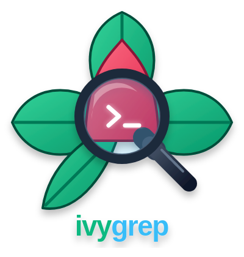
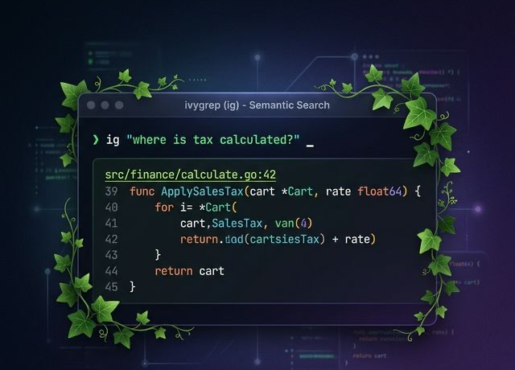
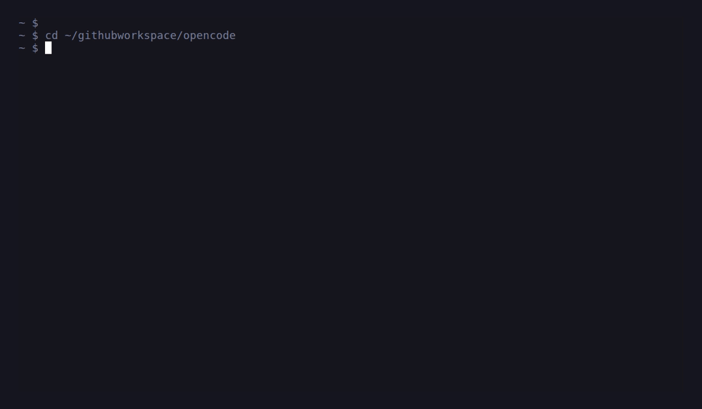

<p align="center">
  
</p>

<p align="center">
  <strong>Semantic code search that never phones home.</strong><br/>
  Ask questions in English. Get answers in code. 100% local.
</p>

<p align="center">
  <a href="https://github.com/bvolpato/ivygrep/actions"></a>
  <a href="https://github.com/bvolpato/ivygrep/releases/latest"></a>
  <a href="https://github.com/bvolpato/ivygrep/blob/main/LICENSE"></a>
  <a href="https://github.com/bvolpato/ivygrep/releases"></a>
</p>

<p align="center">
  
</p>

---

## ⚡ Quick Start

**Install via Homebrew (recommended):**
```bash
brew tap bvolpato/tap
brew install bvolpato/tap/ivygrep
```

**Build from source:**
```bash
git clone https://github.com/bvolpato/ivygrep.git && cd ivygrep
cargo build --release
install -m 0755 ./target/release/ig ~/.local/bin/ig
```

**Your first search:**
```bash
ig "authentication flow"            # auto-indexes on first run, then searches
ig "error handling" src/api/         # scope to a directory
ig --all "database migrations"      # search across all indexed projects
```

That's it. No config files, no setup wizards, no prompts, no API keys. On first run, `ig` auto-indexes the workspace and spawns a background daemon for incremental updates.

<p>
  
</p>

---

## 🤖 MCP Server — Supercharge Your AI Agent

ivygrep is the **retrieval layer your coding agent is missing**. Instead of stuffing entire files into context, your agent pulls only the relevant code chunks natively.

```bash
ig --mcp    # starts MCP server on stdio
```

### One-line setup for agents:

<details>
<summary><b>Claude Code</b></summary>

```bash
claude mcp add -s user ig -- ig --mcp
```
Or add to `~/.claude.json`:
```json
{
  "mcpServers": {
    "ig": { "type": "stdio", "command": "ig", "args": ["--mcp"] }
  }
}
```
</details>

<details>
<summary><b>Cursor</b></summary>

Add to `.cursor/mcp.json` or `~/.cursor/mcp.json`:
```json
{
  "mcpServers": {
    "ig": { "command": "ig", "args": ["--mcp"] }
  }
}
```
Then refresh MCP servers in Cursor settings.
</details>

<details>
<summary><b>Gemini</b></summary>

```bash
gemini mcp add --scope user --transport stdio ig ig --mcp
```
Or add to `~/.gemini/settings.json`:
```json
{
  "mcpServers": {
    "ig": { "command": "ig", "args": ["--mcp"] }
  }
}
```
</details>

<details>
<summary><b>OpenCode & Codex</b></summary>

**OpenCode:** `opencode mcp add` -> Choose `Local` and set command to `ig --mcp`.

**Codex:** Run `codex mcp add ig -- ig --mcp` or add to `~/.codex/config.toml`.
</details>

---

## 🤔 What is ivygrep?

**ivygrep (`ig`)** is a local-first code search tool that understands natural language. It combines lexical search (like `grep`/`rg`) with semantic vector search — so you can search your code the way you *think* about it.

Traditional tools require you to know _exactly_ what you're looking for. ivygrep lets you search with intent.

| Feature | `grep` / `rg` | GitHub Search | **ivygrep** |
|---------|:---:|:---:|:---:|
| Works offline | ✅ | ❌ | ✅ |
| Natural language queries | ❌ | ⚠️ | ✅ |
| Semantic understanding | ❌ | ❌ | ✅ |
| Sub-100ms latency | ✅ | ❌ | ✅ |
| Privacy-first (no upload) | ✅ | ❌ | ✅ |
| Git-native (worktrees, branches) | ❌ | ❌ | ✅ |
| Structural code chunking | ❌ | ❌ | ✅ |
| Incremental indexing | ❌ | ❌ | ✅ |
| MCP server for AI agents | ❌ | ❌ | ✅ |

### 🌍 44 Languages Supported
ivygrep indexes and structurally chunks 44 languages today:

- **Tree-sitter AST chunking (20 languages):** Rust, Python, Go, JavaScript, TypeScript, Java, C, C++, C#, Scala, PHP, Ruby, Swift, Bash, Haskell, OCaml, Lua, Dart, Objective-C, Perl
- **Heuristic structural chunking:** the remaining supported languages below

- **Systems:** Rust, C, C++, Zig, Nim
- **Backend:** Python, Go, Java, Kotlin, Scala, C#, Ruby, PHP, Perl, Groovy
- **Web & Mobile:** JavaScript, TypeScript, HTML, CSS, GraphQL, Swift, Dart, Objective-C
- **Functional:** Haskell, OCaml, Elixir, Erlang, Clojure
- **Data, Scripting & Config:** R, Julia, Bash, PowerShell, Lua, SQL, Protobuf, Terraform, TOML, YAML, JSON, Dockerfile, Makefile

Unknown extensions are auto-detected and indexed as text.

---

## 🚀 Performance & Speed

Benchmarked on the **Linux kernel** (92K files, 1.5M chunks) and **2GB+ monorepos** (289K files, 3.8M chunks):

| Tool | Mode | Time | Speedup |
|------|------|-----:|--------:|
| `grep -rn` | exact string | ~9.0 s | 1× |
| `rg` | exact string | ~2.7 s | 3× |
| **`ig`** | semantic: `"kernel memory allocation"` | **~72 ms** | **125×** |
| **`ig --literal`** | **single identifier** (fast path) | **~17 ms** | **529×** |
| **`ig --regex`** | **regex on 2GB+ monorepo** | **~200 ms** | **60×** |

Regex search extracts literal fragments from patterns and uses the Tantivy inverted index to pre-filter candidates before parallel scanning with rayon — turning a 12-second full-repo scan into a 200ms targeted search.

Indexing is sub-second for most projects. Search is sub-100ms. Small repos can complete neural enhancement before first results; larger repos return immediately and upgrade in the background via the bundled ONNX model (`AllMiniLML6V2Q`).

---

## 🏗️ Architecture & Git-Native Intelligence

ivygrep deeply understands git. This is a core design decision, not an afterthought:
- **Worktree overlays:** Doesn't duplicate indexes contextually. Creates thin overlays mapping divergent chunks.
- **Branch-switch deltas:** Targets Merkle-diff re-indexes of *only* changed files upon branch switch.
- **Content-based deduplication:** Byte-identical files are never re-indexed across branches.
- **`.gitignore` native:** Respects rules automatically at every level.

**Tech stack:** `tantivy` (BM25), `usearch` (vector store), `tree-sitter` (AST), `fastembed` (embeddings), `xxh3` (SIMD hashes).

---

## 🔧 CLI Reference

```bash
# Core workflow
ig "your query"                    # search current workspace
ig "query" ~/other/project         # search a different workspace
ig --add .                         # register & index a workspace
ig --rm .                          # unregister a workspace
ig --status                        # show workspace health & embedding status
ig doctor                          # inspect index health for the current workspace
ig doctor --fix                    # rebuild a broken or stale index

# Search modes
ig --interactive \"query\"             # interactive TUI with file/snippet browsing
ig --literal \"fn_name\"               # fast exact-match search (index-backed)
ig --regex "fn\s+\w+_tax"          # regex mode (like rg)
ig --hash "query"                  # force hash embeddings (skip neural)

# Output control
ig -n 5 "query"                    # limit to 5 files
ig -C 4 "query"                    # 4 lines of context
ig --type rust "query"             # filter by language
ig --include "*.rs,*.go" "query"   # include globs
ig --exclude "vendor/**" "query"   # exclude globs
ig --json "query"                  # machine-readable JSON
ig --first-line-only "query"       # compact grep-style output
ig --file-name-only "query"        # file paths only

# Daemon & server
ig --daemon                        # start background watcher
ig --mcp                           # start MCP server (stdio)
```

---

## 🧪 Development

```bash
cargo fmt && cargo clippy --all-targets -- -D warnings && cargo test
```
The test suite covers unit tests, CLI snapshots, concurrency, golden queries, incremental CRUD, property-based Merkle invariants, and stress/benchmarks.

### Stress testing
```bash
./scripts/bootstrap_stress_fixtures.sh
cargo test --test stress_harness -- --ignored --nocapture
```

## Roadmap

- **More Tree-sitter languages:** expand the AST pipeline to Kotlin, SQL, and additional grammars as high-quality tree-sitter parsers mature.
- **Symbol retrieval:** store symbol tables during chunking, add a second index for definitions, references, and call edges. Enable `symbol`, `refs`, and `callers` workflows without replacing the current hybrid text retrieval.

- **Editor integrations:** VS Code extension and Neovim telescope plugin for in-editor semantic search.
- **Windows support:** resolve usearch/simsimd MSVC compatibility for native Windows builds.
- **Background job resilience:** richer queue diagnostics and resumable worker state across daemon restarts.

## Contributing

Contributions are welcome! See [CONTRIBUTING.md](CONTRIBUTING.md) for guidelines.

---

<p align="center">
  Built by <a href="https://github.com/bvolpato">@bvolpato</a> · Released under the MIT License
</p>
