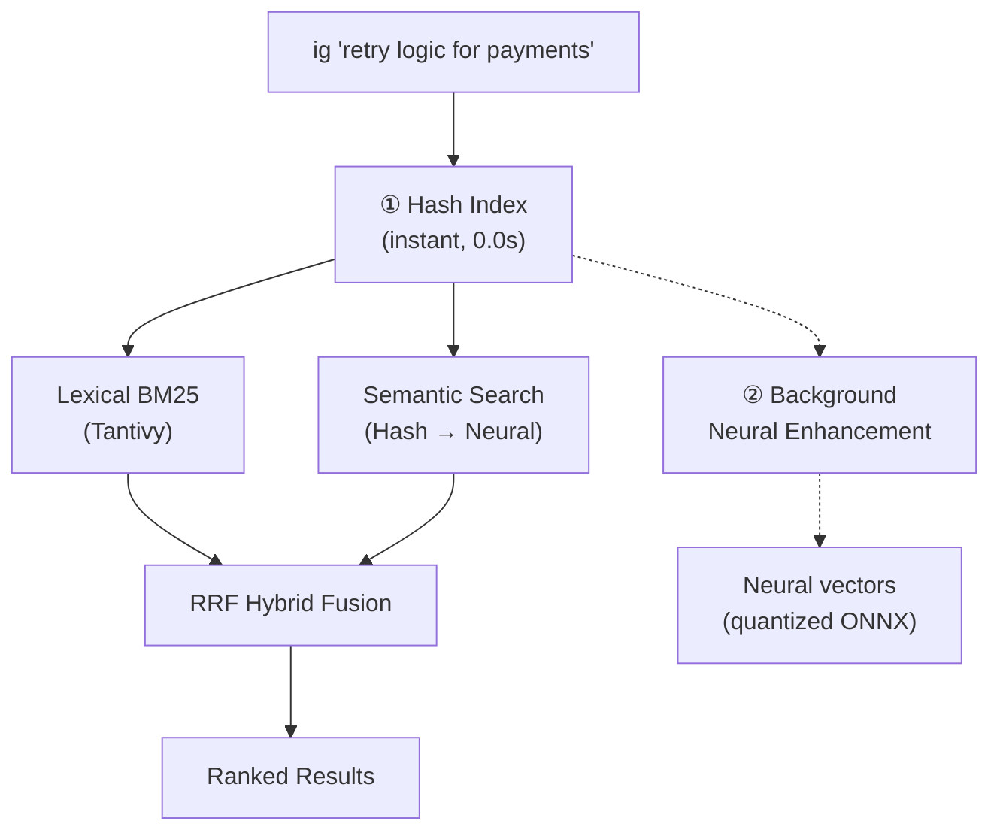

<p align="center">
  
</p>

<p align="center">
  <strong>Semantic code search that never phones home.</strong><br/>
  Ask questions in English. Get answers in code. 100% local.
</p>

<p align="center">
  <a href="https://github.com/bvolpato/ivygrep/actions"></a>
  <a href="https://github.com/bvolpato/ivygrep/releases/latest"></a>
  <a href="https://github.com/bvolpato/ivygrep/blob/main/LICENSE"></a>
  <a href="https://github.com/bvolpato/ivygrep/releases"></a>
</p>

<p align="center">
  
</p>

---

## ⚡ What is ivygrep?

**ivygrep (`ig`)** is a local-first code search tool that understands natural language. It combines lexical search (like `grep`/`rg`) with semantic vector search — so you can search your code the way you *think* about it.

```bash
# Ask in English, find the code
ig "where is tax calculated?"
# → finds calculateTaxes(), applyVAT(), computeWithholding()

ig "database connection retry logic"
# → finds reconnect(), exponentialBackoff(), handleDbTimeout()
```

> **No API keys. No cloud. No telemetry. Your code never leaves your machine.**

---

## 🤔 Why ivygrep?

Traditional code search tools require you to know _exactly_ what you're looking for. ivygrep lets you search with intent.

| Feature | `grep` / `rg` | GitHub Search | **ivygrep** |
|---------|:---:|:---:|:---:|
| Works offline | ✅ | ❌ | ✅ |
| Natural language queries | ❌ | ⚠️ | ✅ |
| Semantic understanding | ❌ | ❌ | ✅ |
| Sub-100ms latency | ✅ | ❌ | ✅ |
| Privacy-first (no upload) | ✅ | ❌ | ✅ |
| AST-aware chunking | ❌ | ❌ | ✅ |
| Incremental indexing | ❌ | ❌ | ✅ |
| MCP server for AI agents | ❌ | ❌ | ✅ |

---

## 🚀 Quick Start

### Install

**Homebrew** (recommended):
```bash
brew tap bvolpato/tap
brew install bvolpato/tap/ivygrep
```

**From source**:
```bash
git clone https://github.com/bvolpato/ivygrep.git && cd ivygrep
cargo build --release
install -m 0755 ./target/release/ig ~/.local/bin/ig
```

> **Note on macOS**: Building on macOS automatically enables the Apple CoreML Execution Provider, offloading embedding generation to the Neural Engine / GPU with zero configuration.

**Binary downloads**: grab the latest from [Releases](https://github.com/bvolpato/ivygrep/releases/latest) — available for Linux (x86/ARM) and macOS (Intel/Apple Silicon).

### First search in 10 seconds

```bash
ig "authentication flow"            # auto-indexes on first run, then searches
ig "error handling" src/api/         # scope to a directory
ig --all "database migrations"      # search across all indexed projects
```

That's it. No config files, no setup wizards, no prompts, no API keys. On first run, `ig` auto-indexes the workspace instantly and spawns a background daemon for incremental updates.

> **Tip**: Indexing is instant — `ig` uses hash embeddings for sub-second startup, then silently upgrades to neural embeddings in the background.

<p>
  
</p>

---

## 🧠 How It Works

ivygrep uses a **two-tier hybrid search architecture** — instant indexing with progressive quality upgrades:



**On first search:**
1. **Index instantly** with structural hashes (~0.0s for typical repos, via 128-bit SIMD `xxh3`)
2. **Stream into DB** through an asynchronous MPSC chunking pipeline, maintaining absolute minimal memory footprints (handling even the 85,000+ files of the Linux kernel smoothly).
3. **Return results** immediately via lexical + hash-semantic fusion.
4. **Enhance silently** — a background daemon independently processes neural (ONNX) embeddings utilizing throttled CPUs to maintain responsiveness.
5. **GPU Acceleration** — on macOS, ONNX natively links to Apple CoreML Execution Providers, offloading matrix multiplications entirely to the ANE (Apple Neural Engine) autonomously.
6. **Subsequent queries** seamlessly adopt the high-precision neural vectors!

Use `ig --status` to transparently examine how each workspace is dynamically tracking inside the background daemon:

```
⟐ /Users/you/project
  Index:  ✓ indexed (2m ago)
  Files:  41 files, 440 chunks
  Size:   1.7 MB
  Search: ⟳ enhancing (computing AllMiniLML6V2Q via CoreML in background...)
          (200 / 440 chunks, ~45%)
```

> If you wish to forcibly blockade `ig` queries from evaluating strictly UNTIL neural indexing hits 100% (to prevent partial BM25 hybridization), pass the `--wait-for-enhancement` flag.

- **Lexical path** — BM25 scoring via [Tantivy](https://github.com/quickwit-oss/tantivy) catches exact keyword matches
- **Semantic path** — starts with hash embeddings (instant), upgrades to quantized ONNX neural embeddings in background
- **Intelligent pre-filtering** — File globs (`--include`, `--exclude`) and language filters natively push down into Tantivy `BooleanQuery` and SQLite `LIKE` queries to avoid full-corpus vector scaling on massive (2M+ chunks) monolithic repos.
- **AST chunking** — [tree-sitter](https://tree-sitter.github.io) splits code into precise function/class boundaries (35+ languages)
- **Incremental indexing** — Merkle-style fingerprints mean re-index only touches changed files

---

## ⚡ Performance

### Indexing

| Operation | Time | Notes |
|-----------|------|-------|
| **First index** (40 files) | **0.0s** | Hash embeddings — instant |
| **First index** (200 files) | **0.3s** | Parallel hash pipeline |
| **Re-index** (no changes) | 0.01s | Merkle diff only |
| **Neural enhancement** | ~24s | Background, non-blocking |

### Search — ivygrep vs grep vs ripgrep

Benchmarked on the **Linux kernel** (92K files, 1.5M chunks) — query: `"kfree"`:

| Tool | Mode | Time | Speedup |
|------|------|-----:|--------:|
| `grep -rn` | exact string | ~9.0 s | 1× |
| `rg` | exact string | ~2.7 s | 3× |
| **`ig`** | **single identifier** (fast path) | **~17 ms** | **529×** |
| **`ig --regex`** | exact string regex | **~25 ms** | **360×** |
| **`ig`** | semantic: `"kernel memory allocation"` | **~72 ms** | **125×** |

> `grep` and `rg` scan every file on each query. ivygrep queries a pre-built
> index, so searches are **orders of magnitude faster** on warm repos — and
> semantic mode finds related code even when you don't know the exact identifier.

### Concurrent search (AI agent load, 8 threads)

| Metric | Value |
|--------|-------|
| **Average latency** | ~26 ms |
| **p95 latency** | ~62 ms |
| **Max latency** | ~98 ms |

> Indexing is instant. Search is instant. Neural quality upgrades happen silently.

---

## 🤖 MCP Server — Supercharge Your AI Agent

ivygrep is the **retrieval layer your coding agent is missing**. Instead of stuffing entire files into context, your agent pulls only the relevant code chunks.

```bash
ig --mcp    # starts MCP server on stdio
```

### One-line setup for every major agent:

<details>
<summary><b>Claude Code</b></summary>

```bash
claude mcp add -s user ig -- ig --mcp
```

Or add to `~/.claude.json`:
```json
{
  "mcpServers": {
    "ig": { "type": "stdio", "command": "ig", "args": ["--mcp"] }
  }
}
```
</details>

<details>
<summary><b>Cursor</b></summary>

Add to `.cursor/mcp.json` or `~/.cursor/mcp.json`:
```json
{
  "mcpServers": {
    "ig": { "command": "ig", "args": ["--mcp"] }
  }
}
```
Then refresh MCP servers in Cursor settings.
</details>

<details>
<summary><b>Codex</b></summary>

```bash
codex mcp add ig -- ig --mcp
```

Or add to `~/.codex/config.toml`:
```toml
[mcp_servers.ig]
command = "ig"
args = ["--mcp"]
```
</details>

<details>
<summary><b>OpenCode</b></summary>

```bash
opencode mcp add
```

Choose `Local` and set command to `ig --mcp`.

Or add to `opencode.json`:
```json
{
  "$schema": "https://opencode.ai/config.json",
  "mcp": {
    "ig": { "type": "local", "command": ["ig", "--mcp"] }
  }
}
```
</details>

### Example agent prompt

> *"Refactor the payment flow. First call ig_search with path=src/payments to find where tax is computed."*

The agent searches, finds the exact function, and edits grounded in real code — not hallucinations.

### MCP tool

`ig_search(query, path?, limit?, context?, type?, regex?, include?, exclude?, first_line_only?, file_name_only?, verbose?)`

- Auto-indexes on first call
- Scopes to subdirectory or file
- Respects `.gitignore`
- Compact JSON output (token-efficient for LLMs)

---

## 🌍 44 Languages Supported

ivygrep provides AST-aware chunking for functions, classes, and modules:

| Category | Languages |
|----------|-----------|
| **Systems** | Rust, C, C++, Zig, Nim |
| **Web** | JavaScript, TypeScript, HTML, CSS, GraphQL |
| **Backend** | Python, Go, Java, Kotlin, Scala, C#, Ruby, PHP, Perl, Groovy |
| **Functional** | Haskell, OCaml, Elixir, Erlang, Clojure |
| **Mobile** | Swift, Dart, Objective-C |
| **Scientific** | R, Julia |
| **Shell** | Bash/Zsh, PowerShell, Lua |
| **Data/Infra** | SQL, Protobuf, Thrift, Terraform, TOML, YAML, JSON, XML |
| **Other** | Markdown, Dockerfile, Makefile, and plain text |

> Unknown extensions are auto-detected — if it looks like text, it gets indexed.

---

## 🔧 CLI Reference

```bash
# Core workflow
ig "your query"                    # search current workspace
ig "query" ~/other/project         # search a different workspace
ig --add .                         # register & index a workspace
ig --rm .                          # unregister a workspace
ig --status                        # show workspace health & embedding status
ig --status --json                 # machine-readable workspace status
ig --all "query"                   # search all indexed workspaces

# Search modes
ig --regex "fn\s+\w+_tax"          # regex mode (like rg)
ig --hash "query"                  # force hash embeddings (skip neural)

# Output control
ig -n 5 "query"                    # limit to 5 files
ig -C 4 "query"                    # 4 lines of context
ig --type rust "query"             # filter by language
ig --include "*.rs,*.go" "query"   # include globs
ig --exclude "vendor/**" "query"   # exclude globs
ig --json "query"                  # machine-readable JSON
ig --first-line-only "query"       # compact grep-style output
ig --file-name-only "query"        # file paths only
ig --verbose "query"               # include match reasons

# Daemon & server
ig --daemon                        # start background watcher
ig --mcp                           # start MCP server (stdio)
```

> **Tip**: The daemon auto-spawns on your first search — no manual startup needed. Set `IVYGREP_NO_AUTOSPAWN=1` to disable (useful in CI).

---

## 🏗️ Architecture

```
ivygrep
├── tantivy         — lexical BM25 index
├── usearch         — vector similarity index (hash + neural stores)
├── tree-sitter     — AST-based code chunking (35+ languages)
├── fastembed       — quantized ONNX embeddings (AllMiniLML6V2Q, 384-dim, CoreML accelerated)
├── xxh3 (xxhash)   — hyper-fast 128-bit SIMD structural block hashes
├── notify          — filesystem watcher for live re-indexing
├── SQLite          — metadata store natively synced via Async MPSC streaming channels
└── Unix socket     — daemon IPC (auto-spawned)
```

**Index location**: `${IVYGREP_HOME:-${XDG_DATA_HOME:-~/.local/share}/ivygrep}/indexes/<workspace-id>/`

Each workspace stores two vector indexes:
- `vectors.usearch` — hash-based (always present, instant to compute)
- `vectors_neural.usearch` — ONNX-based (created in background after first search)

**Neural embeddings**: The default build bundles ONNX Runtime for high-quality semantic search. The quantized model (~23 MB) downloads automatically on first use. Indexing never blocks on this — it happens in the background. For a minimal binary without ONNX: `cargo build --release --no-default-features`.

---

## 🧪 Development

```bash
cargo fmt && cargo clippy --all-targets -- -D warnings && cargo test
```

The test suite covers unit tests, CLI snapshots, concurrency, golden queries,
incremental CRUD, property-based Merkle invariants, and stress/benchmarks.

### Stress testing

```bash
./scripts/bootstrap_stress_fixtures.sh
cargo test --test stress_harness -- --ignored --nocapture
```

Fixtures include ripgrep, Shakespeare corpus, and Tantivy source.

---

## 📄 License

MIT — use it however you want.

---

<p align="center">
  Built by <a href="https://github.com/bvolpato">@bvolpato</a> · Contributions welcome
</p>
