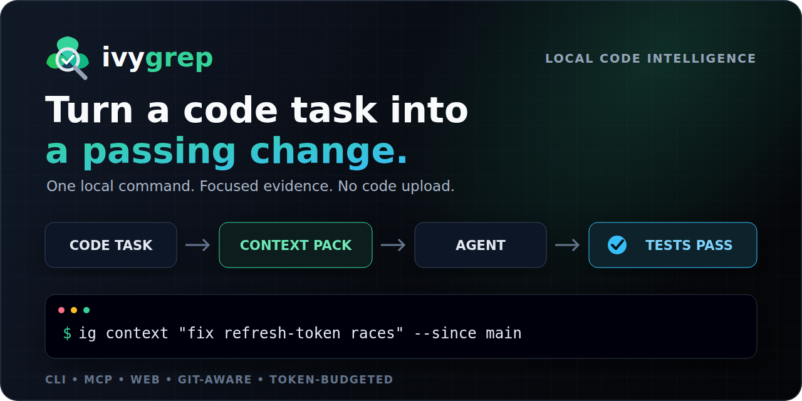

<p align="center">
  
</p>

<p align="center">
  <strong>Turn code tasks, diffs, and stack traces into focused context packs for coding agents.</strong><br/>
  Local code intelligence. No code upload.
</p>

<p align="center">
  <a href="https://github.com/bvolpato/ivygrep/actions/workflows/ci.yml"></a>
  <a href="https://github.com/bvolpato/ivygrep/actions/workflows/security.yml"></a>
  <a href="https://github.com/bvolpato/ivygrep/actions/workflows/relevance.yml"></a>
  <a href="https://github.com/bvolpato/ivygrep/releases/latest"></a>
  <a href="LICENSE"></a>
</p>

<p align="center">
  
</p>

<p align="center">
  <a href="https://bvolpato.github.io/ivygrep/">Website</a> ·
  <a href="https://bvolpato.github.io/ivygrep/benchmarks/">Benchmarks</a> ·
  <a href="CONTRIBUTING.md">Contributing</a> ·
  <a href="https://github.com/bvolpato/ivygrep/discussions">Discussions</a>
</p>

## 30-second task loop

```bash
# 1. Build task context from branch changes, dirty files, and code relationships
ig context "fix refresh-token races" --since main --budget 8000

# 2. Connect coding agent once
ig agent install codex

# 3. Ask agent to use ivygrep context, implement fix, and run focused test
codex "Use ig context for refresh-token race. Fix it and run auth tests."
```

```text
✓ task anchors: refresh token, race
✓ changed files: 3 staged/dirty paths since main
✓ relationships: definitions, callers, dependents, tests, config, docs
✓ selected: 14 snippets / 7,642 estimated tokens
test auth::refresh_token_is_single_use ... ok
```

`ig context` returns one bounded, evidence-rich pack instead of making agents
guess paths or load whole files. Every snippet includes selection reason and
relationship. CLI, MCP, and Web use same structured pack.

```bash
ig context "fix refresh-token races" --budget 8000  # complete task pack
ig context "fix refresh-token races" --since main   # commits + dirty worktree
cat stacktrace.log | ig context - --budget 8000      # issue or trace from stdin
ig --json context "task" --budget 16000              # structured output
```

Packs cover definitions, callers, references, dependencies, dependents, tests,
configuration, documentation, exact paths/lines, and recent co-change evidence.
`--type`, `--include`, and `--exclude` scope complete Markdown pack.

## Install

```bash
brew install bvolpato/tap/ivygrep
```

```bash
curl -fsSL https://raw.githubusercontent.com/bvolpato/ivygrep/main/install.sh | sh
```

```powershell
irm https://raw.githubusercontent.com/bvolpato/ivygrep/main/install.ps1 | iex
```

Installers select compatible archive, verify SHA-256, install `ig`, and report
selected backend. Apple Silicon uses Metal. Supported NVIDIA Linux hosts use
Linux x86_64 CUDA when CUDA 13 runtime and compute capability 8.0+ are present.
Others use portable local inference. Run `ig hardware` for detected hardware,
compatibility limits, and exact reinstall command.

Build from source:

```bash
git clone https://github.com/bvolpato/ivygrep.git && cd ivygrep
./build.sh
install -m 0755 target/release/ig ~/.local/bin/ig
```

## Search

First query auto-indexes current repository. Daemon then watches incremental
changes.

```bash
ig "where is authentication handled?"       # hybrid semantic + lexical
ig --literal "handleAuth"                    # exact indexed lookup
ig --symbol calculate_tax                    # definitions
ig --refs calculate_tax                      # references and calls
ig --callers calculate_tax                   # caller chunks
ig "database migrations" src/api/           # path scope
ig --all "retry policy"                      # all indexed projects
ig --interactive "auth flow"                 # terminal UI
ig --web "auth flow" .                       # local Web UI
```

Useful controls: `-n` result files, `-C` context lines, `--type` language,
`--include`/`--exclude` globs, `--lexical-only`, `--hash`, `--json`, and
`--no-index`. Run `ig --help` for full reference.

## Connect coding agents

Automatic setup detects client, preserves existing configuration, writes
absolute `ig` path, verifies MCP handshake, and runs real search:

```bash
ig agent install claude
ig agent install codex
ig agent install cursor
ig agent doctor
```

Restart open client after installation. Manual MCP setup remains available:

```bash
claude mcp add -s user ig -- ig --mcp
codex mcp add ig -- ig --mcp
gemini mcp add --scope user --transport stdio ig ig --mcp
```

Cursor `.cursor/mcp.json`:

```json
{"mcpServers":{"ig":{"type": "stdio", "command": "ig", "args": ["--mcp"]}}}
```

OpenCode `opencode.json`:

```json
{"mcp":{"ig":{"type": "local", "command": ["ig", "--mcp"], "enabled": true}}}
```

Agents call `ig_search` for discovery. Set `output=context_pack` and
`budget_tokens=8000` for implementation packs. Pass absolute current repository
or worktree path. Worktrees reuse base index and store only divergent chunks and
tombstones.

Recommended agent instruction:

```text
Use ivygrep before broad filesystem scans. Pass absolute active worktree path.
Use natural-language queries for concepts and literal=true for identifiers.
For implementation, request output=context_pack with budget_tokens=8000.
```

## Why ivygrep

| Capability | `rg` | Hosted search | ivygrep |
|---|:---:|:---:|:---:|
| Natural-language intent | No | Limited | Yes |
| Exact and semantic retrieval | Exact | Varies | Yes |
| Task/diff context packs | No | No | Yes |
| Definitions, callers, tests, config, docs | No | Varies | Yes |
| Git worktree overlays | No | No | Yes |
| Local-only code and queries | Yes | No | Yes |
| CLI, MCP, and Web | CLI | Web/API | Yes |

ivygrep combines Tantivy BM25, exact lookup, USearch ANN, Tree-sitter chunks,
SQLite relationship graph, local Candle embeddings, and Git-aware incremental
indexes. Search publishes lexical results first while neural vectors build in
background. Ranking stays deterministic.

45 language and file types are supported. 24 use Tree-sitter AST chunking,
including Rust, Python, Go, JavaScript, TypeScript, Java, C/C++, C#, Kotlin,
Scala, PHP, Ruby, Swift, Elixir, Zig, Bash, Haskell, OCaml, Lua, Dart,
Objective-C, Perl, and Starlark.

## Measured performance

Deterministic one-million-chunk benchmark currently records 15.07 ms warm p95,
109,006 chunks/s controlled indexing, and 0.46 GiB final index. Hardware,
repository shape, model, and index state affect results. See
[benchmark dashboard](https://bvolpato.github.io/ivygrep/benchmarks/evidence-dashboard.html)
and [raw evidence](https://bvolpato.github.io/ivygrep/benchmarks/evidence-dashboard.json).

## Local and private

Code, queries, embeddings, and indexes stay local. Neural mode downloads pinned
model assets once. Use `--hash` or hash-only build for no model download.

`ig --web` binds loopback by default. Non-loopback mode prints authenticated
URL but uses plain HTTP. Use trusted network, Tailscale, or encrypted tunnel.
Never expose listener directly to internet. File contents, including non-ignored
dotfiles, can appear in local index and snippets.

Report vulnerabilities through [private security advisory](SECURITY.md), not
public issue. Release archives include checksums, SBOMs, and provenance.

## Contribute

```bash
./test.sh --quick
./test.sh
./bench.sh
```

Start with [good first issue](https://github.com/bvolpato/ivygrep/labels/good%20first%20issue),
read [CONTRIBUTING.md](CONTRIBUTING.md), or shape ideas in
[Discussions](https://github.com/bvolpato/ivygrep/discussions).

MIT licensed. Built by [@bvolpato](https://github.com/bvolpato).
