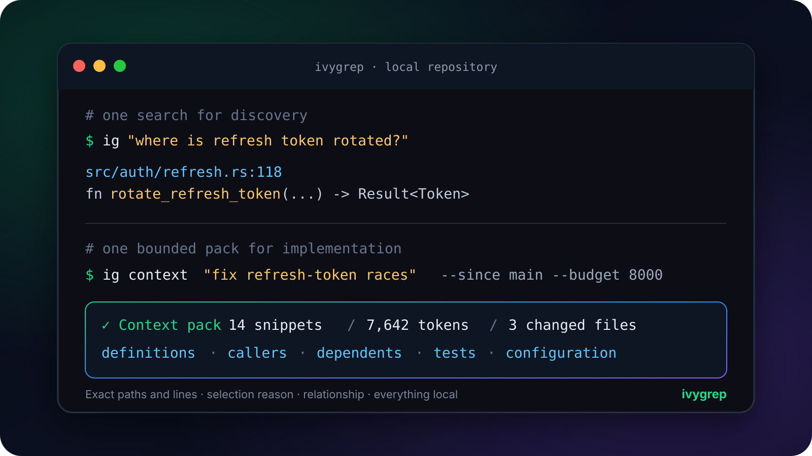

<p align="center">
  
</p>

<p align="center">
  <strong>Turn coding tasks into bounded, branch-aware context.</strong><br/>
  One search for discovery. One implementation map from task, current Git changes, and code relationships. Everything stays local.
</p>

<p align="center">
  <a href="https://github.com/bvolpato/ivygrep/actions/workflows/ci.yml"></a>
  <a href="https://github.com/bvolpato/ivygrep/actions/workflows/security.yml"></a>
  <a href="https://github.com/bvolpato/ivygrep/actions/workflows/relevance.yml"></a>
  <a href="https://github.com/bvolpato/ivygrep/releases/latest"></a>
  <a href="LICENSE"></a>
</p>

<p align="center">
  
</p>

<p align="center">
  <a href="https://bvolpato.github.io/ivygrep/">Website</a> ·
  <a href="https://bvolpato.github.io/ivygrep/benchmarks/">Benchmarks</a> ·
  <a href="CONTRIBUTING.md">Contributing</a> ·
  <a href="https://github.com/bvolpato/ivygrep/discussions">Discussions</a>
</p>

## Search and build context

```bash
# Find code by intent
ig "where is refresh token rotated?"

# Build context from code and current changes
ig context "fix refresh-token races" --since main --budget 8000
```

```text
src/auth/refresh.rs:118
fn rotate_refresh_token(...)

Context pack: 14 snippets / 7,642 estimated tokens
Coverage: changed files, definitions, callers, dependents, tests
```

Search answers where. Context answers what an agent needs to change safely.

The context command combines task anchors with commits since the branch point, staged and dirty files, paths from an issue or trace, and indexed code relationships. It returns one bounded Markdown pack. Every snippet includes its path, lines, role, selection reason, and relationship to the task.

## Install

```bash
brew install bvolpato/tap/ivygrep
```

```bash
curl -fsSL https://raw.githubusercontent.com/bvolpato/ivygrep/main/install.sh | sh
```

```powershell
irm https://raw.githubusercontent.com/bvolpato/ivygrep/main/install.ps1 | iex
```

WinGet submission is [awaiting registry approval](https://github.com/microsoft/winget-pkgs/pull/404590). crates.io publishing is prepared but not live yet. Use one of the supported installers above until those registries list ivygrep.

Installers select a compatible archive, verify its SHA-256 checksum, install `ig`, and report the selected backend. Apple Silicon uses Metal. NVIDIA Linux hosts use the Linux x86_64 CUDA build when CUDA 13 and compute capability 8.0 or newer are available. Other systems use portable local inference. Run `ig hardware` to see detected hardware, compatibility limits, and the matching reinstall command.

Build from source:

```bash
git clone https://github.com/bvolpato/ivygrep.git && cd ivygrep
./build.sh
install -m 0755 target/release/ig ~/.local/bin/ig
```

## Search

The first query indexes the current repository. The daemon then watches for changes and updates the index incrementally.

```bash
ig "where is authentication handled?"       # hybrid semantic + lexical
ig --literal "handleAuth"                    # exact indexed lookup
ig --symbol calculate_tax                    # definitions
ig --refs calculate_tax                      # references and calls
ig --callers calculate_tax                   # caller chunks
ig "database migrations" src/api/           # path scope
ig --all "retry policy"                      # all indexed projects
ig --interactive "auth flow"                 # terminal UI
ig --web "auth flow" .                       # local Web UI
```

Useful controls include `-n` for result files, `-C` for context lines, `--type` for language, `--include` and `--exclude` for path globs, plus `--lexical-only`, `--hash`, `--json`, and `--no-index`. Run `ig --help` for the full reference.

## Search notes and memories

ivygrep also indexes Markdown, text, JSON, and other document files. Precompute local vectors once, then search a notes directory by meaning:

```bash
ig --add ~/notes --wait-for-enhancement
ig -n 20 "what did we decide about cache invalidation?" ~/notes
```

Default daemon-backed queries across CLI, MCP, Web, and TUI blend semantic and lexical retrieval; no semantic opt-in flag is required. For implicit questions whose initial results are overwhelmingly note-like files, ivygrep automatically runs two generic local memory probes concurrently and fuses their ranks. The index stays live as notes change. Queries, note contents, embeddings, and results stay local.

On the public [MemoryQuest benchmark](https://bvolpato.github.io/ivygrep/benchmarks/public-memory-retrieval.html), default CLI search retrieved 74.9% of required memories in the top 20 and retrieved every required memory for 44.9% of questions. Warm CLI p95 was 86.05 ms across 535 implicit questions and 3,878 preindexed sessions. Report documents protocol, single-query control, published reference points, and comparability limits.

## Connect coding agents

Codex and Claude Code packages install MCP configuration plus focused task-context skill:

```bash
codex plugin marketplace add bvolpato/ivygrep
codex plugin add ivygrep@ivygrep

claude plugin marketplace add bvolpato/ivygrep
claude plugin install ivygrep@ivygrep
```

Automatic setup detects the client, preserves existing configuration, writes the absolute `ig` path, verifies the MCP handshake, and runs a search:

```bash
ig agent install claude
ig agent install codex
ig agent install cursor
ig agent doctor
```

Restart an open client after installation. Manual MCP setup is also available:

```bash
claude mcp add -s user ig -- ig --mcp
codex mcp add ig -- ig --mcp
gemini mcp add --scope user --transport stdio ig ig --mcp
```

Cursor `.cursor/mcp.json`:

```json
{"mcpServers":{"ig":{"type": "stdio", "command": "ig", "args": ["--mcp"]}}}
```

OpenCode `opencode.json`:

```json
{"mcp":{"ig":{"type": "local", "command": ["ig", "--mcp"], "enabled": true}}}
```

Agents call `ig_search` for discovery. Set `output=context_pack` and `budget_tokens=8000` when the task needs implementation context. Pass the absolute path to the active repository or worktree. Worktrees reuse the base index and store only changed chunks and tombstones.

Context packs can include definitions, callers, references, dependencies, dependents, tests, configuration, and docs.

Setup guides: [Codex](https://bvolpato.github.io/ivygrep/integrations/codex.html), [Claude Code](https://bvolpato.github.io/ivygrep/integrations/claude-code.html), [Cursor](https://bvolpato.github.io/ivygrep/integrations/cursor.html), [Gemini CLI](https://bvolpato.github.io/ivygrep/integrations/gemini-cli.html), [OpenCode](https://bvolpato.github.io/ivygrep/integrations/opencode.html), and [MCP](https://bvolpato.github.io/ivygrep/integrations/mcp.html).

Recommended agent instruction:

```text
Use ivygrep before broad filesystem scans. Pass absolute active worktree path.
Use natural-language queries for concepts and literal=true for identifiers.
For implementation, request output=context_pack with budget_tokens=8000.
```

## Repository context, not another result list

- **Current work is input.** `--since main` brings committed branch changes, staged files, dirty files, and untracked files into retrieval.
- **Relationships expand the task.** Definitions, callers, references, dependencies, dependents, tests, configuration, docs, and recent co-changes connect likely implementation surfaces.
- **Token budget is a contract.** Context selection, deduplication, and trimming produce one pack sized for the receiving agent.
- **Evidence stays inspectable.** Exact paths and lines, roles, reasons, and relationships explain why every snippet is present.
- **Worktrees stay thin.** Each worktree reuses its repository's base index and stores only divergent chunks and tombstones.
- **Indexes stay live.** Changed chunks update incrementally. Lexical results remain available while neural vectors build in the background.
- **One context model serves every client.** CLI, JSON, MCP, and Web return the same structured evidence.

Search when exploring. Build context when implementing.

ivygrep combines Tantivy BM25, exact lookup, USearch ANN, Tree-sitter chunks, a SQLite relationship graph, local Candle embeddings, and Git-aware incremental indexes. Lexical results are available while neural vectors build in the background. Ranking is deterministic.

ivygrep supports 45 language and file types. Twenty-four use Tree-sitter AST chunking, including Rust, Python, Go, JavaScript, TypeScript, Java, C/C++, C#, Kotlin, Scala, PHP, Ruby, Swift, Elixir, Zig, Bash, Haskell, OCaml, Lua, Dart, Objective-C, Perl, and Starlark.

## System performance

On the deterministic one-million-chunk corpus, v1.2.7 median warm CLI p95 is 6.19 ms, controlled indexing reaches 150,576 chunks/s, and the final index is 0.42 GiB across three sequential trials. These are system measurements, not agent outcomes. Hardware, repository shape, model, index state, and load affect results.

[Current-release evidence](https://bvolpato.github.io/ivygrep/benchmarks/public-million-current.json) · [Million-chunk methodology and historical paired study](https://bvolpato.github.io/ivygrep/benchmarks/public-million.html) · [Full benchmark dashboard](https://bvolpato.github.io/ivygrep/benchmarks/evidence-dashboard.html)

## Local and private

Code, queries, embeddings, and indexes stay local. Neural mode downloads pinned model assets once. Use `--hash` or a hash-only build to avoid model downloads.

`ig --web` binds to loopback by default. A non-loopback listener prints an authenticated URL but still uses plain HTTP. Use a trusted network, Tailscale, or an encrypted tunnel, and never expose the listener directly to the internet. File contents, including non-ignored dotfiles, can appear in the local index and snippets.

Report vulnerabilities through a [private security advisory](SECURITY.md). Release archives include checksums, SBOMs, and provenance.

## Contribute

```bash
./test.sh --quick
./test.sh
./bench.sh
```

Start with a [good first issue](https://github.com/bvolpato/ivygrep/labels/good%20first%20issue), read [CONTRIBUTING.md](CONTRIBUTING.md), or discuss an idea in [Discussions](https://github.com/bvolpato/ivygrep/discussions).

MIT licensed. Maintained by [Bruno Volpato](https://github.com/bvolpato).
