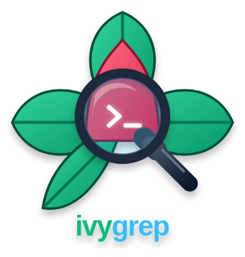
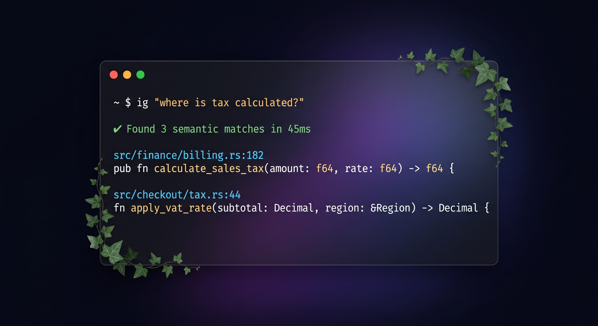
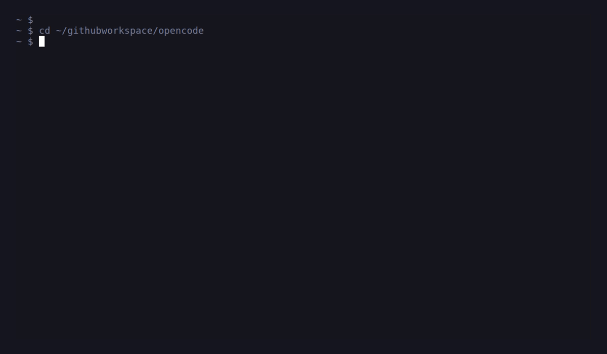

<p align="center">
  
</p>

<p align="center">
  <strong>Semantic code search that never uploads your code.</strong><br/>
  Ask questions in English. Get answers in code. Local inference.
</p>

<p align="center">
  <a href="https://github.com/bvolpato/ivygrep/actions"></a>
  <a href="https://github.com/bvolpato/ivygrep/actions/workflows/security.yml"></a>
  <a href="https://github.com/bvolpato/ivygrep/actions/workflows/relevance.yml"></a>
  <a href="https://github.com/bvolpato/ivygrep/releases/latest"></a>
  <a href="https://github.com/bvolpato/ivygrep/blob/main/LICENSE"></a>
  <a href="https://github.com/bvolpato/ivygrep/releases"></a>
</p>

<p align="center">
  
</p>

<p align="center">
  <a href="https://bvolpato.github.io/ivygrep/">Website</a> ·
  <a href="https://bvolpato.github.io/ivygrep/benchmarks/">Benchmarks</a> ·
  <a href="AGENT_INTEGRATION.md">AI Agents</a> ·
  <a href="ARCHITECTURE.md">Architecture</a> ·
  <a href="CONTRIBUTING.md">Contributing</a>
</p>

---

## ⚡ Quick Start

**Install via Homebrew (recommended):**
```bash
brew install bvolpato/tap/ivygrep
```

**Linux / macOS:**
```bash
curl -fsSL https://raw.githubusercontent.com/bvolpato/ivygrep/main/install.sh | sh
```

**Windows PowerShell:**
```powershell
irm https://raw.githubusercontent.com/bvolpato/ivygrep/main/install.ps1 | iex
```

The installers select the correct release archive, verify its published
SHA-256 checksum, install `ig` in the standard user binary directory, and print
the installed version. The PowerShell installer also updates the user `PATH`.
Windows uses the same USearch approximate-nearest-neighbor backend as Linux and
macOS, with Rust-managed persistence for Unicode paths and replaceable index
files. The binary is long-path aware for deeply nested repositories on current
Windows 10 and Windows 11 systems, and statically links the Visual C++ runtime.

Every release publishes a SHA-256 checksum, SPDX JSON SBOM, and provenance
sidecar for each archive. The release is created only after CI extracts and
runs those exact archive bytes:

| Target | Release behavior | Offline fallback |
|---|---|---|
| Linux x86_64 musl | Static binary, baseline x86-64 exercised under QEMU `qemu64` | Hash search, no model or service |
| Linux aarch64 musl | Static binary exercised under ARM64 QEMU in Alpine | Hash search, no model or service |
| macOS Intel | Native archive with Accelerate-backed local neural inference | Hash search |
| macOS Apple Silicon | Native archive with Accelerate-backed local neural inference | Hash search |
| Windows x86_64 | Native USearch ANN plus local CPU neural inference | Hash search |

The archive procedure covers startup, indexing, hybrid/hash/literal/regex
search, daemon equivalence, status/doctor, stale-index rebuild, and removal.
Running `ig` requires no Python, compiler, system database, or external
service. Neural mode may download its pinned model once; Linux and Windows
acceptance checks verify that the cached model can then be imported without
network access.

Quality, latency, footprint, release-size history, unavailable comparisons,
and the mechanically enforced claim policy are published in the
[evidence dashboard](https://bvolpato.github.io/ivygrep/benchmarks/evidence-dashboard.html).

**Build from source:**
```bash
git clone https://github.com/bvolpato/ivygrep.git && cd ivygrep
./build.sh
install -m 0755 ./target/release/ig ~/.local/bin/ig
```

**Developer targets:**
```bash
./build.sh --help
./test.sh --help
./bench.sh --help

./build.sh          # release binary
./build.sh --features accelerate,metal  # opt-in macOS Metal neural inference
./build.sh --features cuda  # opt-in Linux CUDA neural inference
./test.sh --quick   # fast local check
./test.sh           # fmt, clippy, unit/integration tests
./bench.sh          # critical Criterion benchmark, no stale local baseline comparison
```

**Your first search:**
```bash
ig "authentication flow"            # auto-indexes on first run, then searches
ig "error handling" src/api/         # scope to a directory
ig --all "database migrations"      # search across all indexed projects
```

That's it. No config files, no setup wizards, no prompts, no API keys. On first run, `ig` auto-indexes the workspace and spawns a background daemon for incremental updates. Neural mode downloads its model artifacts into the Hugging Face cache on first use; `--hash` and hash-only builds require no model download.

<p>
  
</p>

---

## 🤖 MCP Server — Supercharge Your AI Agent

ivygrep is the **retrieval layer your coding agent is missing**. Instead of stuffing entire files into context, your agent pulls only the relevant code chunks natively.

```bash
ig --mcp    # starts MCP server on stdio
```

Before connecting an agent, run `ig --version` in the same environment that
launches it. GUI applications may not inherit your interactive shell's `PATH`;
use the absolute path to `ig` or `ig.exe` in that case.

### Setup for coding agents

<details>
<summary><b>Claude Code</b></summary>

```bash
claude mcp add -s user ig -- ig --mcp
```
Or add to `~/.claude.json`:
```json
{
  "mcpServers": {
    "ig": { "type": "stdio", "command": "ig", "args": ["--mcp"] }
  }
}
```
</details>

<details>
<summary><b>Cursor</b></summary>

Add to `.cursor/mcp.json` or `~/.cursor/mcp.json`:
```json
{
  "mcpServers": {
    "ig": { "type": "stdio", "command": "ig", "args": ["--mcp"] }
  }
}
```
Then refresh MCP servers in Cursor settings.
</details>

<details>
<summary><b>Gemini</b></summary>

```bash
gemini mcp add --scope user --transport stdio ig ig --mcp
```
Or add to `~/.gemini/settings.json`:
```json
{
  "mcpServers": {
    "ig": { "command": "ig", "args": ["--mcp"] }
  }
}
```
</details>

<details>
<summary><b>Codex</b></summary>

```bash
codex mcp add ig -- ig --mcp
codex mcp get ig --json
```

The CLI and IDE extension share `~/.codex/config.toml`. Trusted repositories
can instead use a project-scoped `.codex/config.toml`.
</details>

<details>
<summary><b>OpenCode</b></summary>

Add to `opencode.json`:
```json
{
  "$schema": "https://opencode.ai/config.json",
  "mcp": {
    "ig": {
      "type": "local",
      "command": ["ig", "--mcp"],
      "enabled": true
    }
  }
}
```
</details>

### Recommended agent behavior

Give the agent this persistent instruction in `AGENTS.md`, `CLAUDE.md`,
`GEMINI.md`, or the equivalent rules file:

```text
Use the ivygrep MCP tools for code discovery before broad filesystem scans.
Pass the absolute current repository or worktree path to ig_search.
Use natural-language queries for concepts and literal=true for exact identifiers.
Use limit to choose retrieval breadth and context to choose source lines per hit.
Start with limit=5-10 and context=2. Increase context when a promising hit needs
more evidence; increase limit when you need more candidate files.
Use ig_status when indexing health is unclear.
```

`ig_search` is restricted to the supplied workspace, auto-indexes on first use,
starts incremental watching, and accepts subdirectory or file paths for narrower
scope. In a Git worktree, pass that worktree's root: ivygrep reuses the shared
base index and stores only overlay deltas and tombstones.

See [Coding agent integration](AGENT_INTEGRATION.md) for verified configs,
tool-selection guidance, worktree behavior, and troubleshooting.

---

## 🤔 What is ivygrep?

**ivygrep (`ig`)** is a local-first code search tool that understands natural language. It combines lexical search (like `grep`/`rg`) with semantic vector search — so you can search your code the way you *think* about it.

Traditional tools require you to know _exactly_ what you're looking for. ivygrep lets you search with intent.

| Feature | `grep` / `rg` | GitHub Search | **ivygrep** |
|---------|:---:|:---:|:---:|
| Works offline | ✅ | ❌ | ✅ |
| Natural language queries | ❌ | ⚠️ | ✅ |
| Semantic understanding | ❌ | ❌ | ✅ |
| Warm indexed query latency | ✅ | ❌ | ✅ |
| Privacy-first (no upload) | ✅ | ❌ | ✅ |
| Git-native (worktrees, branches) | ❌ | ❌ | ✅ |
| Structural code chunking | ❌ | ❌ | ✅ |
| Incremental indexing | ❌ | ❌ | ✅ |
| MCP server for AI agents | ❌ | ❌ | ✅ |

### 🌍 45 Language/File Types Supported
ivygrep indexes and structurally chunks 45 language/file types today:

- **Tree-sitter AST chunking (24 languages):** Rust, Python, Go, JavaScript, TypeScript/TSX, Java, C, C++, C#, Scala, Kotlin, PHP, Ruby, Swift, Elixir, Zig, Bash, Haskell, OCaml, Lua, Dart, Objective-C, Perl, Starlark macros and targets in very large BUILD-like sources
- **Heuristic structural chunking:** the remaining supported languages below

- **Systems:** Rust, C, C++, Zig, Nim
- **Backend:** Python, Go, Java, Kotlin, Scala, C#, Ruby, PHP, Perl, Groovy
- **Web & Mobile:** JavaScript, TypeScript, HTML, CSS, GraphQL, Swift, Dart, Objective-C
- **Functional:** Haskell, OCaml, Elixir, Erlang, Clojure
- **Data, Scripting & Config:** R, Julia, Bash/Shell, PowerShell, Lua, SQL, Protobuf, Thrift, Terraform, Starlark/Bazel, Dockerfile, Makefile, Markdown, XML, TOML/YAML/INI/env config, JSON, plain text

Unknown extensions are auto-detected and indexed as text.

---

## 🚀 Performance & Speed

Fresh release-readiness validation used a **Linux kernel** checkout with 93,502 indexed files and 4,419,660 chunks:

| Scenario | Metric | Result |
|------|------|-----:|
| Fresh lexical-first Linux kernel index | full rebuild | ~270 sec |
| Large-repo natural query | process-cold p95 | ~137 ms |
| Warm daemon identical-query replay | end-to-end p95 | ~79 ms |
| Warm daemon distinct queries | end-to-end p95 | ~116 ms |
| Portable Linux intent relevance | 13 labeled queries | 41.20 |
| Best retained dedicated-host daemon run | identical-query p95 | ~4.9 ms |
| Historical eager-vector Linux kernel index | full rebuild | ~27.3 min |
| Lexical-first scoped stress probe | 10,501 files | ~3 sec |
| Warm daemon correctness guard | daemon/local hits | 20 / 20 |

The daemon benchmark reports warmed distinct-query latency separately from
identical-query cache replay. Latency depends on CPU, storage, repository
shape, index state, and virtualization; dedicated-host measurements are not
universal claims. Reproducible public quality, latency, indexing, refresh, and
resource evidence lives under [`docs/benchmarks/`](docs/benchmarks/).

Indexing commits BM25/literal search first. A load-aware background subprocess
builds hash ANN vectors, then upgrades to the portable 256-dimensional
`static-retrieval-v1` model selected by the public embedding bake-off. Set
`IVYGREP_MODEL_PROFILE=potion-code` for the pinned code-specialized Model2Vec
profile, `general` for the pinned general MiniLM profile, or `code` for the
CodeSearchNet-trained MiniLM profile. Optional profiles are retained for
comparison and compatibility rather than recommended laptop defaults. Model
identity is persisted with the index so incompatible vectors are rebuilt rather
than silently reused.

Optional transformer profiles share one immutable model across background
workers. `IVYGREP_NEURAL_THREADS` sets the desired worker ceiling; ivygrep
automatically lowers additional workers after accounting for the required
shared model and one quarter of currently available memory. Set
`IVYGREP_NEURAL_MEMORY_MB` to impose a smaller explicit worker-sizing budget.
At least one model handle is still required, so this setting is not an OS-level
hard memory cap. Linux accounting honors the process's effective cgroup
hierarchy, including containers.

Relevance evaluation separates foreground readiness from post-background hash
quality:

```bash
uv run scripts/eval_relevance.py
uv run scripts/eval_relevance.py --enhance-hash
uv run scripts/run_public_benchmark_matrix.py \
  --profile public-core \
  --datasets-root /tmp/ivygrep-public-datasets \
  --work-root /tmp/ivygrep-public-results \
  --output public-code-retrieval-results.json
```

The public matrix pins 20 CoIR task/language variants and retains a compact
1,000-query baseline spanning 48 languages, with raw-result checksums, per-task
quality, run variance, latency, memory, and index size. The current report and
machine-readable result live under
[`docs/benchmarks/`](docs/benchmarks/).

---

## 🏗️ Architecture & Git-Native Intelligence

ivygrep deeply understands git. This is a core design decision, not an afterthought:
- **Worktree overlays:** Reuses one base search index. Per-worktree SQLite, lexical, and vector stores contain only divergent chunks and tombstones; lightweight Merkle metadata tracks filesystem state.
- **Branch-switch deltas:** Merkle reconciliation re-indexes *only* changed files upon branch switch instead of rebuilding the search index.
- **Content-based deduplication:** Byte-identical files are never re-indexed across branches.
- **`.gitignore` native:** Respects rules automatically at every level.

**Tech stack:** `tantivy` (BM25), `usearch` (ANN), `tree-sitter` (AST), SQLite
symbol/call graph storage,
`candle_embed` / `candle-core` (local neural embeddings), and `xxh3` hashes.

---

## 🔒 Security & Privacy

ivygrep runs search and embedding inference locally and never sends your code, queries, or index data to an external service. A few things worth knowing:

- **Where data lives:** the index stores compressed source chunks under `~/.local/share/ivygrep` (or `$XDG_DATA_HOME`/`$IVYGREP_HOME`). Unix uses an owner-only `0600` socket plus peer-uid verification. Windows uses loopback TCP with a per-daemon authentication token stored beside the user-owned index. Keep a custom `IVYGREP_HOME` private to your account.
- **Model download:** neural mode uses `hf-hub` to download revision-pinned model assets on first use and caches them under `$HF_HOME` or `~/.cache/huggingface`. The default is `sentence-transformers/static-retrieval-mrl-en-v1`; `IVYGREP_MODEL_PROFILE=potion-code` selects an optional code-specialized static profile, while `general`, `code`, and `code-hq` select optional transformer profiles. Cached assets work without network access. Use `--hash` or a `--no-default-features` build when model assets must never be downloaded.
- **Inference backend:** macOS release binaries execute locally with Accelerate-backed CPU math; Linux and Windows release binaries execute locally on CPU. Source builds can opt into local Metal with `--features accelerate,metal` or CUDA with `--features cuda` on a compatible installation. The CUDA build does not require cuDNN. If `nvidia-smi` cannot report compute capability, `build.sh` and `test.sh` infer `CUDA_COMPUTE_CAP=120` for RTX 50/Blackwell hosts; set `CUDA_COMPUTE_CAP` explicitly for other affected GPUs. `ig --status` reports the recorded backend that last generated neural vectors.
- **Resource controls:** indexing refuses to start below 512 MiB available memory, background enhancement pauses below 1 GiB, and optional transformer workers share model weights plus an adaptive memory budget. These checks use native available-memory reporting on macOS and Windows and cgroup-aware reporting on Linux.
- **Secrets in your repo:** ivygrep indexes file *contents*, including config/dotfiles (e.g. `.env`) unless they're gitignored. Those contents are stored in the local index and can appear in search snippets. Keep secrets out of the workspace or in `.gitignore`.
- **MCP scope:** the `ig_search` MCP tool only searches the workspace at the provided `path` — it cannot search across other indexed projects.

---

## 🔧 CLI Reference

```bash
# Core workflow
ig "your query"                    # search current workspace
ig "query" ~/other/project         # search a different workspace
ig --add .                         # register & index a workspace
ig --rm .                          # unregister a workspace
ig --status                        # show workspace health & embedding status
ig --doctor                        # inspect index health for the current workspace
ig --doctor --deep                 # run full cross-store integrity scans
ig --doctor --fix                  # rebuild a broken or stale index

# Search modes
ig --interactive "query"             # interactive TUI with file/snippet browsing
ig --literal "fn_name"               # fast exact-match search (index-backed)
ig --lexical-only "query"          # BM25/path/signature retrieval only
ig --hash "query"                  # force hash embeddings (skip neural)
ig --symbol calculate_tax          # exact definitions
ig --refs calculate_tax            # indexed references/calls
ig --callers calculate_tax         # caller chunks

# Output control
ig -n 5 "query"                    # at most 5 ranked result files
ig -C 4 "query"                    # up to 4 lines before and after each match
ig -n 5 -C 8 "query"               # 5 files with richer snippets
ig --type rust "query"             # filter by language
ig --include "*.rs,*.go" "query"   # include globs
ig --exclude "vendor/**" "query"   # exclude globs
ig --json "query"                  # machine-readable JSON
ig --first-line-only "query"       # compact grep-style output
ig --file-name-only "query"        # file paths only

# Daemon & server
ig --daemon                        # start background watcher
ig --mcp                           # start MCP server (stdio)
```

`--limit` and `--context` are independent controls:

**Use `--limit` to choose how broadly ivygrep searches and how many ranked files
it may return. Use `--context` to choose how much source text appears around
each hit. Neither option is a relevance threshold.**

| Control | What it changes | Ranking |
|---|---|---|
| `-n N`, `--limit N` | Searches a candidate pool sized for the request and returns at most `N` ranked files | The same relevance signals apply; a deeper pool can slightly change ranks |
| `--no-limit` | Uses maximum candidate budgets and returns every result that survives relevance filtering | Can change ranks and is slower |
| `-C N`, `--context N` | Shows up to `N` source lines before and after each focused match | Unchanged |
| `--first-line-only` | Reduces each result to one preview line after retrieval | Unchanged |
| `--file-name-only` | Returns paths only; without `-n`, the CLI also uses maximum candidate budgets | Unchanged with `-n`; without `-n`, the deeper pool can change ranks |

- `--limit` controls breadth, not the ranker's relevance objective. A larger
  value searches deeper, which improves the chance of finding additional
  relevant files but also includes progressively lower-ranked candidates.
- Results remain score-ordered. A smaller limit truncates the response to the
  highest-ranked files found for that request. It does not deliberately return
  less-relevant files, but a relevant file below the cutoff will not be shown.
- Because ivygrep sizes its candidate pool from the requested limit, increasing
  the limit can introduce candidates that slightly rerank the top results.
  `--limit` is a maximum file count, not a line, token, or confidence budget.
- Without `--limit`, normal candidate retrieval remains bounded, but no
  explicit final result-file cap is applied. `--no-limit` expands retrieval to
  the maximum candidate budgets and can be much slower.
- `--context N` returns up to `N` lines before and after each focused match.
  It changes snippet size only, not retrieval or ranking. For example, `-C 4`
  returns at most nine lines per hit when file boundaries allow.
- `--first-line-only` changes presentation only. `--file-name-only -n N` also
  keeps retrieval bounded by `N`. For grep-style path discovery,
  `--file-name-only` without `-n` uses maximum candidate budgets; add `-n` when
  you need a predictable result count and latency.

Fewer snippet tokens do not mean fewer result files, better relevance, or worse
relevance. They mean less source text was returned for the selected files.
Relevance is measured separately with ranking metrics such as nDCG and,
ultimately, whether the returned evidence is sufficient for the task.

For agents, set an explicit limit: start with `-n 5` to `-n 10` and `-C 2`.
Increase context when the right file is present but the snippet is too small.
Increase the result limit when the result set does not contain enough distinct
files. Narrow `path`, `--type`, `--include`, or `--exclude` when results are
topically correct but too broad.
ivygrep does not currently expose a total token-budget parameter.

Do not treat the internal fused score as a globally calibrated confidence
value. Scores are meaningful for ordering one query's results, but a fixed
minimum-score threshold would not transfer reliably across queries or
repositories. Use rank, path/type filters, and task evidence to decide whether
the returned set is sufficient.

---

## 🧪 Development

```bash
./test.sh           # fmt, ShellCheck, clippy, Rust and Python harness tests
./build.sh --locked # release binary, Cargo.lock unchanged
./build.sh --locked --features accelerate,metal  # opt-in macOS Metal neural binary
./build.sh --locked --features cuda  # opt-in Linux CUDA neural binary
./bench.sh          # critical Criterion benchmark, no stale local baseline comparison
```
The test suite covers unit tests, CLI snapshots, concurrency, golden queries,
public-layout retrieval metrics, symbol/caller indexing, incremental CRUD, MCP,
daemon recovery, git/worktree behavior, property-based Merkle invariants, and
benchmark guards.
Benchmark output reports per-operation latency; short-looking numbers are repeated inside Criterion so actual timed samples remain long enough to be stable.

### End-to-end procedures
```bash
./build.sh
./scripts/e2e_procedures.sh --binary ./target/release/ig
python3 scripts/check_daemon_equivalence.py \
  --skip-build \
  --binary ./target/release/ig \
  --bench-home /tmp/ivygrep-daemon-equivalence

# Opt-in macOS Metal backend validation (downloads local model artifacts on first run)
./build.sh --locked --features accelerate,metal
./scripts/e2e_neural_backend.sh --binary ./target/release/ig --model-profile general --expect-backend "Candle Metal"

# Opt-in Linux CUDA backend validation (downloads local model artifacts on first run)
./build.sh --locked --features cuda
./scripts/e2e_neural_backend.sh --binary ./target/release/ig --model-profile general --expect-backend "Candle CUDA"
```
These smoke tests run against throwaway projects and isolated `IVYGREP_HOME` directories; the neural backend check embeds fixture text locally and verifies recorded backend reporting.

### Stress testing
```bash
./scripts/bootstrap_stress_fixtures.sh
./test.sh --stress
```

## Roadmap

- **More Tree-sitter languages:** expand the AST pipeline to SQL and additional grammars as high-quality tree-sitter parsers mature.
- **Evidence-backed search program:** track the quality,
  latency, footprint, and portability work in
  [#128](https://github.com/bvolpato/ivygrep/issues/128).
- **Learned reranking:** evaluate compact local cross-encoders against the
  bounded deterministic reranker without weakening offline portability.
- **Editor integrations:** VS Code extension and Neovim telescope plugin for in-editor semantic search.
- **Background job resilience:** richer queue diagnostics and resumable worker state across daemon restarts.

## Contributing

Contributions are welcome! See [CONTRIBUTING.md](CONTRIBUTING.md) for guidelines.

---

<p align="center">
  Built by <a href="https://github.com/bvolpato">@bvolpato</a> · Released under the MIT License
</p>
