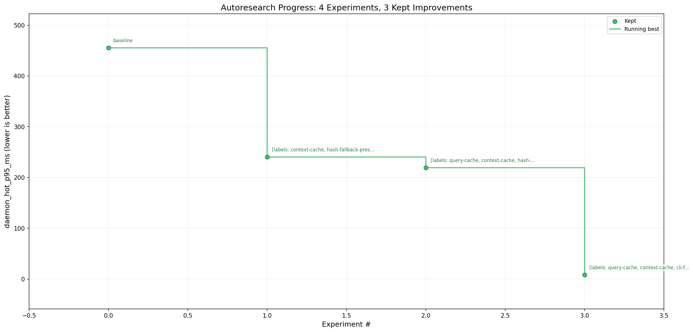
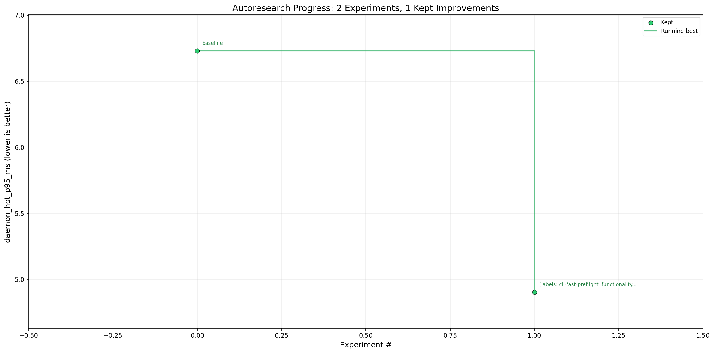

# Daemon hot-query cache benchmark

Linux kernel checkout: `/home/bruno/githubworkspace/linux`

Benchmark homes:

- `/tmp/ivygrep-linux-bench-home`
- `/tmp/ivygrep-daemon-equivalence-home`

Primary command:

```bash
python3 scripts/bench_daemon_hot_query.py \
  --kernel /home/bruno/githubworkspace/linux \
  --bench-home /tmp/ivygrep-linux-bench-home \
  --samples 9 \
  --warmups 3
```

Regression guard:

```bash
cargo fmt -- --check
cargo clippy --locked --all-targets -- -D warnings
cargo test --locked --all-targets
python3 -m py_compile scripts/bench_daemon_hot_query.py scripts/check_daemon_equivalence.py
python3 scripts/check_daemon_equivalence.py --bench-home /tmp/ivygrep-daemon-equivalence-home
```

## Main Optimization Loop



| Step | Change | daemon_hot_p95_ms | Delta |
| --- | --- | ---: | ---: |
| Baseline | process-cold CLI vs warm daemon baseline | 455.37 | - |
| 1 | cache daemon `SearchContext` by workspace and embedding dimension | 240.04 | -215.32 |
| 2 | cache repeated daemon query results behind bounded request/index key | 219.03 | -21.01 |
| 3 | use quick query index health before daemon hot queries | 8.04 | -211.00 |

Final manual validation after cleanup measured `daemon_hot_p95_ms = 5.88` with `daemon_hits = 20` and `local_hits = 20`.

Raw results: [daemon-hot-query-cache-results.tsv](daemon-hot-query-cache-results.tsv)

## Regression Exploration Loop



| Step | Change | daemon_hot_p95_ms | Delta |
| --- | --- | ---: | ---: |
| Baseline | post-main-loop 9-sample baseline | 6.73 | - |
| 1 | skip daemon `Status` preflight for static `IVYGREP_NO_AUTOSPAWN` hot-query runs with existing socket | 4.90 | -1.83 |

The explore guard kept functionality coverage explicit:

- daemon/local JSON equivalence: 7 representative cases, 0 failures, including `--all` after single-workspace cache warmup
- full `cargo test --locked --all-targets`
- full `cargo clippy --locked --all-targets -- -D warnings`
- `daemon_hits = 20`
- `local_hits = 20`

Raw results: [daemon-hot-query-cache-explore-results.tsv](daemon-hot-query-cache-explore-results.tsv)
