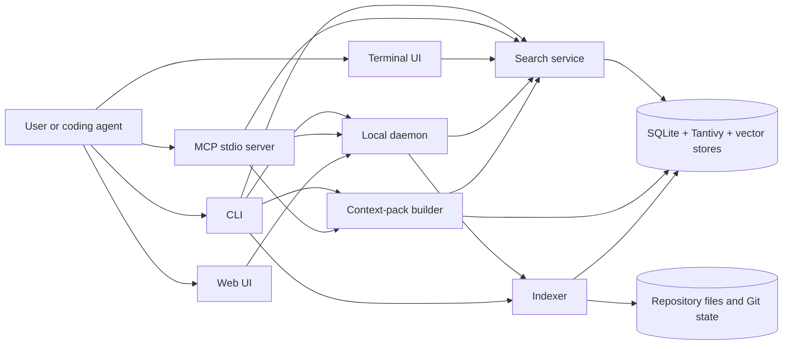

# ivygrep architecture

This document explains current repository structure and runtime behavior. It is
written for contributors who need to change indexing, retrieval, context packs,
or client integrations without breaking storage or protocol contracts.

Source code remains authoritative. Public behavior belongs in tests and CLI
help; this document records boundaries and invariants that are easy to miss when
reading one module at a time.

## Design constraints

ivygrep is built around six constraints:

1. **Repository data stays local.** Source, queries, indexes, embeddings, and
   results are processed on the user's machine. Neural profiles may download
   pinned model assets on first use.
2. **Lexical search becomes usable first.** A fresh index commits searchable
   text before optional hash and neural vector enhancement finishes.
3. **Results are bounded and inspectable.** Search limits candidate work.
   Context packs enforce a token budget and explain why each item was selected.
4. **Index updates preserve the last healthy state.** Fresh rebuilds use staging
   artifacts. Metadata and snapshots become authoritative only after stores
   commit successfully.
5. **Git worktrees reuse data without leaking base content.** A worktree reads
   its repository's base index plus a small overlay of changes and tombstones.
6. **Clients share contracts, not one oversized executor.** CLI, daemon, MCP,
   TUI, and Web reuse search options and aggregation while retaining their own
   lifecycle, caching, progress, and cancellation behavior.

## Runtime map



CLI and MCP can use local execution paths when daemon routing is unavailable or
inappropriate. Daemon adds watchers, shared caches, background jobs, and Web
serving; it is not required for every read path.

## Entry points and client surfaces

| Surface | Primary code | Responsibility |
| --- | --- | --- |
| Binary entry | `src/main.rs`, `src/cli.rs` | Parse commands, choose daemon or local execution, format output |
| Daemon | `src/daemon.rs`, `src/ipc.rs`, `src/jobs.rs` | Watch workspaces, schedule jobs, cache search state, serve IPC |
| MCP | `src/mcp.rs` | Expose `ig_search` and `ig_status` over JSON-RPC stdio |
| TUI | `src/tui.rs` | Interactive search, navigation, and file preview |
| Web server | `src/web.rs` | Serve embedded frontend assets and authenticated local APIs |
| Web frontend | `web/src/` | Search, context, tree, and file-viewer interactions |
| Agent setup | `src/agent.rs` | Configure supported clients and verify one real MCP search |

Cargo builds one binary, `ig`. Default features include local neural retrieval.
`--no-default-features` produces a hash-only build. Platform features select
Accelerate, Metal, or CUDA support where available.

`build.rs` embeds `web/dist` into the binary. Frontend source changes therefore
require a deterministic `pnpm -C web build` and committed generated assets.

## Workspace identity and data location

`Workspace::resolve` canonicalizes the requested path, discovers its repository
root when applicable, and derives a stable workspace identifier. Indexes live
under:

```text
$IVYGREP_HOME/indexes/<workspace-id>/
```

Without `IVYGREP_HOME`, ivygrep uses `$XDG_DATA_HOME/ivygrep` or
`~/.local/share/ivygrep`. On Unix, ivygrep-owned index directories are restricted
to mode `0700` because stored chunks can contain private source text.

Git worktrees share a repository identifier. A secondary worktree records the
main worktree's index directory as its base and stores only divergent state in
its own index directory.

Because index IDs follow canonical paths, replacing a directory can change its
checkout role while retaining its saved index. Health checks reject a saved
main/overlay layout that disagrees with the resolved role. Indexing clears that
obsolete layout under the index lock, preserves workspace settings, and rebuilds
the appropriate stores before local queries use them.

## Index lifecycle

### Initial indexing

1. Resolve workspace and acquire its index lock.
2. Inspect index health and stored format version.
3. Walk indexable files while applying Git ignore rules unless explicitly
   disabled.
4. Build a flat Merkle snapshot of relative paths and file fingerprints.
5. Send files through a bounded scanner/chunker producer.
6. Parse supported languages with Tree-sitter or a bounded text fallback. The
   parse budget counts parser operations, so a file takes the same path on any
   machine; a CPU-time allowance per operation only stops pathological inputs.
7. Extract symbols, imports, documentation relationships, tests, configuration,
   and unresolved dependency records.
8. Persist lexical documents and metadata to staging stores.
9. Commit SQLite and Tantivy, validate staged artifacts, then promote them.
10. Write workspace metadata, generation, format version, and Merkle snapshot.
11. Schedule hash and neural vector enhancement when configured.

Fresh indexing uses staging because SQLite, Tantivy, and vector stores cannot be
committed as one cross-store transaction. Promotion keeps rollback artifacts
until the new set is complete. A failed rebuild leaves the previous index
queryable.

### Incremental indexing

The Merkle snapshot compares current file fingerprints with the last committed
state. Its diff contains added or modified paths plus deleted paths. Incremental
updates replace affected chunks, graph edges, symbols, lexical documents, and
vector keys inside bounded transactions.

Watcher events use a targeted refresh only when path-level reconciliation is
safe. New directories, ignore-file changes, uncertain Git state, and similar
cases fall back to a full walk. A clean Git workspace whose recorded repository
state still matches can return without scanning every file. The fingerprint
includes ancestor `.ignore`/`.gitignore` controls. Reuse is disabled when
independent ignore rules whitelist files Git may ignore, or when assume-unchanged
flags or present skip-worktree files prevent Git status from observing source
edits. Those cases use the normal Merkle walk, including during base reuse.

No-op shortcuts still verify primary storage: SQLite and Tantivy chunk counts
must agree, and hash-vector headers and bounds must be readable. Worktree
indexing checks both overlay and inherited base stores. Failed validation forces
complete staged recovery, not a replay of an empty or partial Merkle delta.
These checks add store-opening/counting work even when source discovery is skipped;
they do not validate every vector payload or compare concurrent enhancement markers.

Main indexes and overlays mark live publication as incomplete before changing
stores. The marker survives failures and is cleared only after stores, metadata,
snapshot, and filter state publish successfully. Main recovery rebuilds in staging;
no-op Git checks, watcher shortcuts, and base reuse cannot trust an unfinished
publication. Fresh main builds also mark the interval between store promotion
and snapshot publication.

Hash and neural vector deletion journals prevent stale embeddings from becoming
visible when another store fails. Merkle state is saved only after committed
stores and metadata agree.

## On-disk stores

| Artifact | Purpose |
| --- | --- |
| `workspace.json` | Root, watch intent, timestamps, and index generation |
| `index_incarnation` | Store identity that changes after main-index or overlay replacement, even if a generation number is reused |
| `metadata.sqlite3` | Chunk text and metadata, symbols, graph edges, unresolved dependencies, statistics |
| `tantivy/` | BM25, path, signature, language, kind, and trigram postings |
| `vectors.usearch` | Lightweight hash-vector index |
| `vectors_neural.usearch` | Learned neural-vector index |
| `neural_profile` and model identity metadata | Vector compatibility contract |
| `merkle_snapshot.json`, `merkle_snapshot.verified` | Last committed path fingerprints and aggregate root hash; the sidecar records the size and mtime of the last snapshot that parsed successfully so health checks skip re-parsing it |
| `job.json`, locks, progress files | Index, enhancement, and watcher coordination |

SQLite stores compressed chunk text when compression is useful. Reads use a
fallible decompression path with a 32 MiB output limit. Corrupt or oversized data
returns a contextual error instead of being treated as source text.

Tantivy is the lexical candidate store. SQLite remains authoritative for rich
chunk metadata and graph relationships. USearch stores F16 vectors and validates
headers, dimensions, and file bounds before native loading. Callers open every
vector store with an explicit `VectorTier`: the hash tier uses a smaller HNSW
graph to bound background build cost, and the neural tier keeps USearch quality
defaults. Vector shape cannot select the tier because the default neural
profile shares the hash store's 256-dimensional F16 layout.

Neural metadata is optional for literal and hash retrieval. Unreadable identity
or profile metadata is reported but does not prevent those modes from loading
healthy primary stores. Neural requests still require readable, compatible
metadata. Doctor diagnoses malformed identities and, with `--fix`, removes only
their derived neural artifacts after acquiring index/job locks and checking that
enhancement is inactive. It keeps an invalid identity until cleanup finishes so
an interrupted repair remains retryable. Neural metadata files publish through
atomic replacement; this is not a power-loss durability guarantee.

Background enhancement serializes vector writers with `enhancement.lock`, which
survives index removal alongside the index and job locks. It takes `index.lock`
only to open its initial stores and to publish checkpoints, metadata, and journal
cleanup. Model inference and resource pauses leave lexical indexing unblocked.
Every publication checks the captured `index_incarnation`; staged main-index and
overlay replacements rotate this identity with their stores, and rollback restores
it. Incremental updates keep the incarnation, leave new deletion journals for the
next pass, and prevent the older worker from marking the new generation complete.

Neural enhancement saves a checkpoint after at least 16,384 new chunks since
the previous checkpoint. A non-divisor batch size crosses that boundary rather
than waiting to land on an exact multiple.

The current on-disk format version is defined by `INDEX_FORMAT_VERSION` in
`src/workspace.rs`. Incompatible schema, chunking, or vector-identity changes
must bump it and provide rebuild or migration behavior.

Format v25 refreshes Python and Objective-C dependency facts through a one-time
full index rebuild, including unchanged files. This is not a graph-only migration;
existing indexes pay the normal indexing and subsequent vector-enhancement costs.

Format v26 also invalidates payloads indexed before contained source reads.
Existing indexes rebuild from current workspace files before their stored text
is trusted as a fallback, even when the source snapshot itself is unchanged.
Direct indexed-source APIs reject incompatible local or inherited base formats
until that rebuild completes.

Format v28 rebuilds existing indexes once so Rust `crate::` and library-name
imports resolve within the owning Cargo package and target, replacing stale
cross-package dependency edges.

Format v29 rebuilds once more to retain resolved import specifications.
Incremental runs use them to refresh unchanged importers when a newly added file
takes precedence over an existing target, and Python package initializers take
precedence over same-named modules.

Format v30 rebuilds once so fallback-chunked files index lines before their
first declaration; Python decorators, decorators before a JavaScript or
TypeScript `export class`, and TypeScript member decorators stay in their
definition's chunk; signatures skip multi-line annotations; and Java records,
module-level JavaScript and TypeScript function bindings, and module-level Rust
`macro_rules!` macros register symbols. A macro declared inside a function stays
in that function's chunk and does not register a definition.

## Search pipeline

### Workspace selection

`src/search_service.rs` resolves one workspace or all registered workspaces and
aggregates results in deterministic score and path order. One broken workspace
produces a warning alongside valid hits. If every selected workspace fails, the
request returns an error rather than an empty result.

### Per-workspace execution

`SearchContext` opens compatible SQLite, Tantivy, and vector stores for one
workspace. Worktree contexts combine base and overlay stores while respecting
tombstones and shadowed paths.

`src/search_routing.rs` classifies query shape and assigns bounded candidate
budgets. Relevant signals include exact identifiers, literals, paths, natural
language, code-like syntax, note-like results, filters, and stored vector
availability.

A hybrid query whose letters and digits are all non-ASCII, such as CJK or
Cyrillic text, has none of the ASCII code tokens that lexical, path, and hash
signals use. Unless neural retrieval is forced, it runs exact substring
matching, the only pass that can find it.

`src/search_execution.rs` coordinates applicable retrieval passes:

- exact substring or regex candidates
- Tantivy BM25 over text, paths, signatures, and trigrams
- exact and inferred symbol candidates
- lightweight hash-vector ANN
- neural ANN when routing requests it and compatible vectors exist
- bounded memory probes for qualifying note-heavy implicit questions

Neural retrieval is conditional. Lexical confidence can make it unnecessary,
and lexical results remain available while neural vectors are incomplete.
`--force-neural` requires compatible persisted neural vectors and makes neural
execution observable in structured output.

Hard visibility and request filters apply before bounded candidate admission.
Without a residual glob, a native Block-WAND traversal first collects the normal
bounded pool, even for daemon requests with cancellation tokens. If every
returned document is eligible, that pool is final. A rejected document triggers
a second traversal with eligibility checked before heap admission. This fallback
reads competitive stored metadata, retains bounded memory, and checks cancellation
per posting; the native probe retains ordinary pre/post cancellation checks.
Residual-glob requests use the cancellable filtered collector directly. If invisible or
missing ANN keys underfill a candidate pool, a cancellation-aware fallback
streams eligible SQLite keys and exactly scores fixed-size batches. This can
scan the eligible corpus, but does not allocate a corpus-sized ANN result set.
Ordinary ANN requests retain shared metadata hydration when no keys are rejected.

Candidate cutoffs do not depend on segment layout. Tantivy breaks equal scores
by document address, which follows indexing threads and merges, and Block-WAND
adds term scores in traversal order, so one document's BM25 score can move by a
few ULPs between layouts. Lexical, path, literal, and Boolean pools compare
scores by bucket (the top 13 of 23 f32 mantissa bits, `6e-5` to `1.2e-4`
relative) and order equal buckets by chunk key from a fast column. Collection
stays one Block-WAND pass: the pruning threshold sits just below the worst kept
bucket, so tied documents are scored, but no stored document is read to order
them. Candidates report bucket scores. Indexes written before the key column
existed keep address order among equal buckets.

Explicit Boolean requests are parsed before expansion. All retrieval signals
are restricted to a request-local pool of raw-query matches bounded by the
normal lexical candidate budget. Semantic scoring ranks only keys in that pool;
it cannot introduce an otherwise similar document that violates the constraint.
Unsupported structured queries, including phrases requiring unindexed positions,
fail explicitly. Quoted or escaped operator words and ordinary natural-language
input keep their existing expansion behavior.

Multi-line queries that read as pasted source score lexical matches without the
boosted signature field. Each pasted identifier would otherwise add a
near-maximal bonus to every one-line definition signature containing it and
bury the snippet's body evidence. Signature text stays searchable through the
body field, and an explicit `signature:` clause keeps its boost. The dotted
`owner.member` heuristic does not create exact-symbol lookups for pasted source,
but mixed-case identifiers inside it, such as `sendFile`, can still become
exact-symbol candidates.

A line reads as code when it ends in `;`, `{` or `}`, starts with `}`, is an
import statement (`import …`, `from … import …`, or `require`, `use` or
`package` with one argument), ends in `:` after a code-shaped token, has at
least as many code-shaped tokens as words, or is indented. An indented list
item is not code, and neither is a continuation: an indented line of words with
no code-shaped tokens that does not end in `:` and follows a prose line that
does not end in `:`, such as a wrapped list item or an indented paragraph.
Code-shaped tokens are operators and identifier shapes such as `=`,
`snake_case`, `camelCase`, `owner.member`, `a::b`, and `call(arg)`. Numbers,
versions, sizes, and issue references such as `1.84.0`, `v1.2.16`, `2.3GB`,
`12k`, and `#375` count as neither, and so do bullets, dashes, table pipes, and
Markdown rules and heading marks. Unicode punctuation around a word, such as
`？`, `。`, curly quotes, and `…`, is trimmed like ASCII punctuation, and `e.g.`
and `and/or` count as words. A multi-line query is pasted source when the
tokens of its code lines plus the code-shaped tokens of its other lines at least
match the words of those other lines. Multi-line pasted error output, described
below, keeps the pasted-source rules.

Multi-paragraph prompts, pasted issue text, and questions with a blank line are
prose. Their lexical matches include the signature field, but without the 5x
boost one-line queries get: a boosted bonus for every term of a long prompt
would lift short definitions that share a word above documents that explain the
task. Their `owner.member` mentions become exact-symbol lookups only on prose
lines, and only when written as code: a call such as `res.send(body)`, a
backtick span, or a camelCase member such as `res.sendFile`. File names, hosts,
and missing spaces such as `go.sum`, `go.dev`, or `it.The` look up nothing.
One-line queries keep their existing `owner.member` lookups. An explicit
`signature:` term clause keeps 5x in any query, including explicit Boolean
queries. Tantivy applies field boosts to term clauses only, so range and set
clauses on the field score the same unboosted value on every query shape.

`src/search_error_text.rs` recognizes pasted error output by line-leading error
labels (`Error:`, `Caused by:`, `ValueError:`, `java.lang.IllegalStateException:`,
`Uncaught TypeError:`), `[ERROR]` lines, traceback headers, `(os error N)`
causes, and `panicked at`. A label other than `Caused by:` counts only when the
line reads as a message: at least two words with letters, no trailing `,`, `;`,
`{`, `(`, `[` or `=`, no bare operator such as `|` or `=`, not a lone quoted
string, and not nested under a line ending in `:`, `{`, `(` or `[`. Struct and
interface fields, object keys, YAML keys, and docstring `Raises:` entries in
pasted source therefore do not count. Only the first 200 lines are classified;
later lines stay in the retrieval text unchanged. For detected queries,
lexical, path, hash-vector, fusion, and learned reranking signals use the text
with runtime values removed: absolute paths outside the workspace, URLs, hex
ids, numbers, and timestamps, including the values of `key=value` pairs, whose
keys stay. A quoted absolute path containing spaces, such as
`"/home/Jane Doe/app.lock"`, is one value. Absolute paths inside the workspace
keep their workspace-relative form. The static message text between those
values, split at quoted values, `key=value` pairs, colon chain separators,
bracketed groups, and sentence ends, joins the exact-substring pass, so code
containing the format string ranks first. Leading timestamps and bracketed
severities such as `[ERROR]` are not part of that text. At most eight runs are
kept: runs from message lines (a counted label, an error severity, or a cause
under `Caused by:`) first, then the longest. When a file's best chunk has no
exact match but another chunk of that file does, fusion shows that chunk for
the file instead, keeping the file's score. Neural query vectors keep the
original text because the daemon embeds the query before it resolves a
workspace. Pasted source without error framing is not affected.

### Fusion and presentation

`src/search_fusion.rs` combines candidates, source provenance, path and role
signals, literal coverage, and deterministic reranking. Fusion remains one
module because ordering and score interactions form one relevance contract.

A hash-vector match on a candidate that lexical, literal, path, or symbol search
already found hashes the same words BM25 scored. For prose, one line or several,
it gets no fusion vote unless the query names secondary sources such as tests,
docs, or examples. Pasted source and multi-line pasted error output keep a vote,
because hash overlap on pasted identifiers still separates the matching snippet.
When hash votes are discounted, neural corroboration votes from the neural
tier's own rank, and semantic-only discoveries keep full weight.

`src/search_presentation.rs` selects representative spans, loads source text,
and builds explanations. Output records source signals and whether neural
retrieval was requested and executed.

Learned file reranking uses canonical two-line context (`-C 2`) for features
and line-based tie breaks. Requested display previews and spans are applied
after ranking, preserving the existing default-context results. Nondefault
context requests retain a second snippet until rendering; both snippets come
from the same file read, with no additional file I/O. Model weights, routing,
candidate budgets, and rerank gates are unchanged.

Setting `IVYGREP_RERANKER_CAPTURE=1` enables an opt-in diagnostic record at the
hybrid search rerank decision point. A single JSON line prefixed with
`IVYGREP_RERANKER_CAPTURE` and a tab is written to stderr, separate from normal
stdout. It includes the schema version, process ID, query, model identity,
feature schema, and actual accepted pre-learned file candidates with canonical
previews and native feature vectors. Ineligible routes and rerank gates emit
an explicit skipped status. Records contain query text and source content,
including canonical context even when display context is zero. Training
collectors must verify a fresh matching process/query record and reject
missing, skipped, or ambiguous captures. With capture unset, no diagnostic
records or feature copies are allocated or written.

Live source reads use `workspace_file.rs` to open regular files beneath the
selected workspace without following child symlinks. Preview metadata and text
come from the same opened file; unavailable live previews use indexed text.

Literal and regex previews return lines up to 1 KiB unchanged. A longer line,
such as a minified bundle or source map, keeps a 1 KiB window around its first
match (context lines keep their start), cut on character boundaries and marked
with `…`, so one hit cannot return megabytes of text. Line numbers and the line
count stay unchanged.

Literal searches retain at most the requested hit count per file and per parallel
partial result set. They preserve path/span ordering without materializing every
matching snippet; source-file reads and explicit unbounded output retain their
existing memory costs.

Literal and regex searches also verify files the indexer walked but stored
without chunks, such as minified bundles. Candidates are Merkle snapshot paths
from the last completed publication that have no effective chunks (overlay
chunks plus untombstoned base chunks), so ignore and exclude decisions are the
indexer's own rather than a second walk's. Coverage is cached per publication
(index and base generations plus the snapshot file identity) and skipped while a
publication marker exists. Literal search drops empty files and files with a NUL
in the sniffed prefix once per publication. Regex search also walks once per
publication for files the snapshot never recorded: files over the 16 MiB
indexing limit, files created since publication, and ignored files when a query
skips ignore rules the index applied. Each query rechecks those walked files
against live ignore rules, so a new exclude hides them even when reindexing has
nothing to publish. Above 4,096 unindexed files, literal keeps indexed
candidates and regex walks the workspace.

Literal, regex, symbol, and caller commands have specialized paths where their
contracts differ from hybrid semantic search. They still reuse workspace,
filtering, grouping, and output types where appropriate.

Symbol rows (`symbols` in SQLite) store the case-folded lookup key, the
exact-case definition `name` when it differs from that key, and an optional
enclosing `owner` (class, impl, struct, module, or Go receiver); language and
kind are read from the joined chunk row, and a `chunk_key` index keeps file
removal proportional to the file's own symbols. Names come
from the Tree-sitter capture at chunk time; the line heuristic is only a
fallback for languages without a grammar, and continuation windows never
register symbols. Qualified lookups (`Owner.method`, `Owner::method`,
`Owner#method`, `Owner->method`) filter by owner, preferring exact-case matches
and falling back to the bare name; reference and caller scans are restricted
to the languages that define the symbol. Adding these columns bumped the index
format to v22.

Format v23 rebuilds existing indexes so unchanged Swift and Objective-C files
receive corrected structural chunks and parser-derived symbol names/owners.
This uses the normal full-index rebuild path, including vector regeneration;
there is no parser-specific partial migration.

Format v27 rebuilds previously truncated Unicode symbol keys, including unchanged
files. Symbol normalization preserves Unicode identifier characters, combining
marks, and JavaScript joiners; case-insensitive lookup still folds ASCII only.
Leading and trailing dollar sigils retain their existing bare-name aliases.

Reference searches use indexed identifier candidates, then verify source syntax.
`--refs` includes non-call uses such as callbacks and function values; `--callers`
returns chunks containing calls. Whitespace, newlines, and generic arguments do
not need to be adjacent to the name. Tree-sitter excludes declaration names,
including Go type, alias, and interface method names, comments, and literal
text; files without a usable parse use quote/comment masking and a conservative
declaration/call heuristic. Qualified references match the immediate textual
receiver name (ignoring scoped generic arguments), not an inferred receiver
type. This is best-effort syntax lookup, not compiler resolution of imports,
aliases, overloads, or shadowed bindings. Go generic calls
that parse as conversions or indexed expressions require a matching indexed
generic-function declaration; ambiguous calls to external generic functions
without indexed definitions remain references only. Bounded requests widen
indexed candidate batches after rejected matches, up to 25,000 chunks. CLI `--no-limit` retains its 50,000-candidate
ceiling; unbounded API requests (`limit: None`) scan all indexed literal candidates.
Each candidate file is parsed at most once for occurrence matching with the
chunker's parse budget. Go generic-function evidence is parsed separately
from matching indexed definition chunks.

## Context-pack pipeline

Context packs answer a different question from ranked search: which bounded set
of evidence helps an agent implement a task safely?

Context seeds and live graph expansion use the same hierarchical ignore policy as
indexing, including `.ignore`, Git excludes, and deleted-file paths. Request-local
matchers cache directory rules without scanning the repository.

1. `src/context_input.rs` parses task text, explicit paths, stack traces, Git
   changes since a base, staged changes, dirty files, and untracked files.
2. Search finds primary implementations and task anchors.
3. `src/context_graph.rs` expands bounded relationships for definitions,
   references, callers, dependencies, dependents, tests, configuration,
   documentation, and recent co-change.
4. `src/context.rs` assigns evidence roles, removes redundant spans, balances
   primary and supporting files, and trims rendered output to the requested
   token budget.
5. Markdown and JSON output include paths, line ranges, roles, reasons, signals,
   change coverage, and budget use.

Dependency extraction is deliberately bounded. Resolved and unresolved import
specifications are stored with lookup keys so newly added files can replace
lower-priority targets without reparsing every unchanged source. Content-only
target edits retain existing edges; deletions, restoration, and manifest changes
refresh affected owners. Missing an edge does not prove no relationship exists.

Python imports and Objective-C quoted local `#import`/`#include` directives are
extracted from parsed syntax. Strings, docstrings, and comments do not create
dependency facts; Objective-C++ also excludes directives inside C++ raw strings.

Rust `self::` and `super::` imports follow the module tree, not the directory
tree: `super::Config` in `src/a/b.rs` resolves to `src/a.rs` or `src/a/mod.rs`.
The line scanner cannot see inline module scope, so indented declarations such
as `use super::helper` inside `mod tests` create no edge. Files without a
conventional parent module file, such as `#[path]` modules, get no `self::` or
`super::` edges either; `self::` in a `mod.rs` still resolves beside the file.

Stack-trace frames under `node_modules`, `site-packages`, `dist-packages`, the
Cargo registry, or the Go module cache map only by their package-relative path,
and `rustc` toolchain frames are ignored. `--since` accepts one commit-ish, such
as `HEAD~3` or `@{upstream}`, and rejects ranges and negated references.

## Worktree overlays

A Git worktree does not copy its repository's complete index. It uses:

- base workspace SQLite, Tantivy, and vectors for unchanged content
- `overlay.sqlite3` for divergent chunks and tombstones
- `overlay_tantivy/` for divergent lexical documents
- `overlay_vectors.usearch` for divergent hash vectors
- `base_ref.json` to record base generation and identity

Search merges base and overlay results, hides deleted or shadowed base paths, and
rejects stale or malformed overlay references that could expose content absent
from the active worktree. Base generation or incarnation changes trigger
reconciliation before overlay content is trusted. A base rebuild can reuse a
generation number, so that counter alone is not an identity. Legacy references
without an incarnation reconcile once; unchanged files still use the shared base.

## Daemon, watchers, and background work

Web context generation follows the daemon's workspace-lease-before-CPU order,
retaining both resources through model preparation and context assembly.

Daemon owns long-lived state that should not be recreated for every query:

- workspace watchers and adaptive debounce
- bounded indexing and enhancement jobs
- reusable search contexts
- query-result and neural-query-vector caches
- Web server sessions
- status, progress, and repair information

Watchers coalesce bursts and cap continuous-event starvation. Successful changes
invalidate only cache entries involving affected workspaces. No-op indexing
preserves valid cache entries.

Cached Git workspace resolution checks filesystem identity and small Git metadata
files without launching Git on unchanged searches. Non-Git paths repeat root
discovery so a newly created ancestor repository is recognized. A changed cached
identity triggers an exclusive index scan before hybrid searches resume; switching
from a linked worktree to a main checkout also replaces the obsolete overlay
stores.

Watcher health is the daemon's job, not the client's. At startup and every 30
seconds a supervisor registers a watcher for each enabled, indexed workspace
that has none; a registration that fails (inotify limits, a missing root) is
recorded in the workspace job ledger and retried with exponential backoff (30 s
doubling to 15 min). The watcher heartbeat re-creates its ledger record when an
index rebuild wiped `job.json`, so a running watcher never reads as offline. A
client that sees `watch_enabled` without `watcher_alive` sends `EnsureWatcher`;
the daemon answers immediately and registers in the background. Clients restart
the daemon only on a protocol version mismatch or when it reports an older build
than the client; a newer daemon speaking the same protocol is used as-is, so
clients left over from before an upgrade do not keep killing it.

Search responses never wait on background enhancement bookkeeping. After the
hits are computed, the daemon schedules a blocking task that checks whether
hash or neural enhancement is needed and triggers the worker, at most once per
workspace and mode every ten seconds.

Heavy work is bounded by a CPU-permit semaphore sized to the core count. Index,
search, and watcher tasks take their per-workspace lease on the blocking pool
first and only then a CPU permit, so requests parked behind an exclusive index
lease never pin CPU capacity that other workspaces could use. Concurrent `Index`
requests for one workspace coalesce: the first request leads, identical requests
await its response, and a request that waited while the index generation
advanced skips the redundant rescan.

`ig --doctor` checks workspace health and can repair stale daemon state or broken
indexes. Status distinguishes lexical readiness, hash coverage, neural coverage,
active jobs, stalled work, watcher health, and compaction recommendations.

## Protocols and compatibility

### Daemon IPC

Daemon uses a versioned JSON-line request envelope. Protocol version 6 added
request IDs and explicit cancellation for hybrid, literal, and regex searches;
version 7 added the fire-and-forget `StartIndex` request (answered with
`IndexStarted`) and the `index_in_flight` runtime-status field; version 8 adds
`EnsureWatcher`, which re-registers missing watchers instead of restarting the
daemon. `DAEMON_PROTOCOL_VERSION` in `src/protocol.rs` holds the current value. Cancellation
also removes queued searches from daemon CPU backpressure. Existing requests
cover version/status, indexing, Web startup, workspace removal, watcher
recovery (`EnsureWatcher`), restart, progress, and structured errors. A client that reaches a daemon speaking an
older protocol (for example a development build with the same build version)
gets a structured version error from the `Version` probe and restarts it.

Cancellation acknowledgements for active searches are sent after registered work
has stopped. Pre-registration cancellations use bounded tombstones so reordered
IPC connections cannot revive stale searches.

Every search also carries a server-side cancellation token. The connection
handler races the search against the client stream reaching EOF and cancels
abandoned work on disconnect; CLI and MCP searches send request IDs and issue
`CancelSearch` when they time out or drop the request. A per-request deadline
(`IVYGREP_SEARCH_DEADLINE_SECS`, default 60 s, `0` disables) cancels long
searches and returns the hits gathered so far with a `warnings` entry. Web
hybrid, literal, and regex searches carry the same token and deadline. A plain
`/api/search` request runs to completion and answers even a client that
half-closed its write side after sending the request. Event-stream searches
write a keep-alive comment every second and drop the search, cancelling it,
when a write fails. Web context requests have no deadline; dropping an
abandoned context stream ends its lease and CPU waits and sets the cancel token
its retrieval searches check.

`warnings` on search results is additive and omitted when empty, preserving
compatibility with older response readers. Unsupported protocol versions and
stale daemon build versions fail explicitly.

Unix uses a mode-`0600` local socket plus peer-UID checks. Windows uses a
loopback TCP endpoint protected by a per-daemon token, read in each
connection's own task so a stalled client cannot delay other accepts. Requests
are capped at 1 MiB and open connections at 512. A connection past the cap
waits up to 2 s for a slot, then gets a busy error in reply to its request.
CLI, TUI, and MCP searches fall back to local search on that error; index,
status, and `--web` requests report it. A `Version` probe still gets the real
version, because clients restart a daemon whose probe fails.
Beyond 64 waiting connections, new connections are closed without a reply.
A served connection that sends no complete request line within 10 s is closed
without a reply, so connections that never send a request cannot hold slots.
The bound covers only the wait for a request, not running requests such as
long searches or indexing.

### MCP

MCP uses JSON-RPC 2.0 over stdio and accepts newline-delimited or
`Content-Length` framing. A message may be a JSON-RPC batch, which protocol
2025-03-26 requires: the reply is one array without entries for notifications,
nothing when no entry remains, and a single Invalid Request error for an empty
batch.

One thread keeps reading stdin while a worker thread runs requests one at a
time in arrival order. The reader answers `ping` and undecodable messages at
once and applies `notifications/cancelled` as it arrives. At most 64 requests,
counting batch members, and 16 MiB of payload wait for the worker, though an
empty queue takes one message of any size. Past either limit the reader stops
reading until the worker takes the next message. A cancelled request gets no
response. If it is still queued, it never starts. If it is running, its cancel
token trips. Local hybrid, literal, and regex searches stop, including those
inside a context pack. Its daemon search gets `CancelSearch`, and the
first-index wait returns. `initialize` is never cancelled. Symbol, reference,
and caller lookups, and an in-process first index (used only when no daemon
answers), run to completion. A newline-delimited message over 16 MiB gets a
`-32700` parse error with a null id, and the server skips to the next line.
Malformed `Content-Length` framing still ends the session, because there is no
safe point to resume. At EOF, requests already read still run before the server
exits. A reply that can't be written ends the session at once, even while stdin
stays open. It exposes:

- `ig_search` for hybrid, literal, regex, symbol, caller, and context-pack work
- `ig_status` for indexed-workspace and runtime state

MCP can auto-index a requested workspace, so search is idempotent but not
read-only. A first index is never awaited for its full duration: `ig_search`
enqueues it on the daemon with `StartIndex` (coalesced with any in-flight run
for that workspace), polls `RuntimeStatus.index_in_flight` for at most
`IVYGREP_MCP_INDEX_WAIT_SECS` (default 20 s), and otherwise returns a non-error
`status: indexing` payload (`progress`, `elapsed_secs`, `retry_after_secs`) read
from the shared job ledger and progress file. The MCP process indexes in-process
only when no daemon is reachable, so it never duplicates a run the daemon owns.
Tool failures return structured MCP errors. Handler panics are isolated instead
of terminating the session.

### Web

Daemon serves embedded assets and APIs for status, search, streaming search,
file reads, editor launch, and workspace trees. File operations enforce tracked
workspace containment.

Loopback is default. Every listener, loopback included, requires a generated
per-daemon session token: any local user can reach a loopback port. API clients
may send it as a bearer token. Loopback listeners accept only loopback Host
names. Content Security Policy, security headers, and request, header, file,
and concurrency limits apply to every listener. Transport is still plain HTTP;
remote use requires a trusted network or encrypted tunnel.

`ig --web` prints the tokenized URL to its own stdout. To open a browser it
writes an HTML redirect page to the app home's `browser/` directory and passes
only that file to `xdg-open`, `open`, or `ShellExecuteW`, so the token never
reaches process arguments that other users can read through `/proc` or `ps`.
On Unix the directory must be owned by the user and is kept at mode `0700`, and
the file is created with mode `0600`; on Windows the file inherits the app
home's ACL. A later launch removes redirect files older than two minutes.
`IVYGREP_NO_BROWSER` skips both the file and the launch. Sandboxed browsers
that cannot read hidden directories under the home directory, such as
snap-packaged Firefox and Chromium on Ubuntu, fail to load the redirect file
under `~/.local/share`; open the printed URL instead. WSL gets no special
handling: the Linux `file://` URL goes to `xdg-open`. `wslview` and xdg-utils
1.2.1 convert it with `wslpath` for a Windows browser. An opener that passes
the URL to a Windows browser unchanged, such as `BROWSER` naming a Windows
executable, points the browser at a missing `C:` path; open the printed URL
instead.

A `/?token=...` request answers with a small same-origin page that sets the
HttpOnly `SameSite=Strict` cookie `ivygrep_session_<port>` and meta-refreshes to
the same URL without the token. A redirect would lose the cookie: opened from
the `file://` page, the navigation is cross-site, and the browser does not send
the new `SameSite=Strict` cookie on the redirected request. The refresh is a
same-origin navigation and needs no inline script under the CSP. The cookie name
carries the listener port because browsers share a host's cookies across ports;
other services on the same host still receive the cookie.

A daemon runs one Web listener. `ig --web` reuses it when `--host` and `--port`
match (port `0` matches any port, and any loopback address matches a loopback
listener) and otherwise fails naming the active address.

## Embeddings and build profiles

Every index can use lightweight hash vectors. Neural-enabled builds also support
pinned model-backed profiles:

- default 256-dimensional static retrieval profile
- Model2Vec PotionCode profiles (`potion-code` v1, `potion-code-v2`)
- optional 384-dimensional Candle transformer profiles
- platform acceleration through Accelerate, Metal, or CUDA builds

Profile name, model revision, dimensions, pooling, normalization, and weight
digest form the neural identity. A mismatch prevents incompatible vectors from
being reused. Model-backed profiles download pinned assets on first use unless
the Hugging Face cache is already populated.

## Environment variables

ivygrep has no configuration file. Flags control per-command behavior; these
variables tune runtime defaults. "Set" means present with any value, including
`0`. Invalid numeric values fall back to the default.

| Variable | Effect |
| --- | --- |
| `IVYGREP_HOME` | Data directory for indexes. Default `~/.local/share/ivygrep` on every OS, or `$XDG_DATA_HOME/ivygrep` when `XDG_DATA_HOME` is set. Empty values are ignored. |
| `IVYGREP_MODEL_PROFILE` | Neural profile: `static-retrieval-v1` (default, 256 dimensions, CPU), the opt-in Model2Vec profiles `potion-code-16m-v1` and `potion-code-16m-v2` (also `potion-code-v2`), or transformer profiles `general`, `code`, and `code-hq` (384 dimensions). CUDA and Metal builds accelerate only transformer profiles. Unknown values use the default. Vectors from another profile are not reused. |
| `IVYGREP_CUDA_LIBRARY_PATH` | Library search path `ig hardware` checks for CUDA runtime libraries, in place of `LD_LIBRARY_PATH`, before falling back to `ldconfig`. `install.sh` instead treats it as an exclusive colon-separated search path, without checking `ldconfig` or standard CUDA directories; an incomplete override can select the portable build. Empty values are ignored. |
| `IVYGREP_AGENT_HOME` | Home directory `ig agent install` and `ig agent doctor` use to find client configuration files. Default: the user's home directory. |
| `IVYGREP_RERANKER` | `learned` (default; also `auto`) or `deterministic` (also `disabled`, `off`). Unknown values report an error in status and use `learned`. |
| `IVYGREP_RERANK_LIMIT` | Fused candidates the reranker reorders per query. A positive integer overrides the routed default: with the learned reranker, 100 for natural-language, docs/tests/examples, and mixed queries and 30 for identifier, path, and literal or error queries; 30 for every query with the deterministic reranker. Other values are ignored. |
| `IVYGREP_SEARCH_DEADLINE_SECS` | Server-side daemon search deadline. Default `60`; `0` disables it. Hits gathered before the deadline return with a warning. |
| `IVYGREP_MCP_INDEX_WAIT_SECS` | Time an MCP call waits for a first index before returning `status: indexing`. Default `20`; `0` returns immediately. |
| `IVYGREP_DISABLE_BACKGROUND_ENHANCEMENT` | Set to disable background hash and neural enhancement. `--wait-for-enhancement` fails. |
| `IVYGREP_NO_AUTOSPAWN` | Set to prevent daemon auto-start. Also disables background enhancement, so `--wait-for-enhancement` fails. |
| `IVYGREP_INDEX_THREADS` | Indexing worker threads. Default: physical cores, capped at logical cores. Background hash and neural enhancement insert vectors through at most four of these threads; `1`, or a store under 1,024 vectors, inserts serially. |
| `IVYGREP_NEURAL_THREADS` | Neural inference threads. Default: logical cores capped at 8 for foreground work; a quarter of logical cores (1 to 8) for background work. Maximum 32. |
| `IVYGREP_NEURAL_BATCH_SIZE` | Chunks per background neural enhancement batch. Default depends on backend (static, CPU, Metal, or CUDA); maximum 4096. |
| `IVYGREP_NEURAL_MEMORY_MB` | Memory budget that sizes transformer worker pools. Default: a quarter of available memory. |
| `IVYGREP_NEURAL_FOREGROUND_ACCELERATOR` | `0`, `false`, `no`, `off`, or `cpu` runs query-time neural embedding on CPU. Unset or any other value uses the preferred backend (Metal or CUDA when available). Background enhancement always uses the preferred backend. |
| `IVYGREP_NEURAL_ACCELERATOR_HANDLES` | Embedder handles in the background Metal or CUDA pool. Default `2`, capped by the neural thread count; positive values are clamped to 1 to 8. Foreground embedding uses one handle, and CPU backends size their pool from `IVYGREP_NEURAL_THREADS` and memory instead. |
| `IVYGREP_DISABLE_QUERY_CACHE` | Set to disable the daemon query-result cache. |
| `IVYGREP_ENHANCE_ON_BATTERY` | `1`, `true`, `yes`, or `on` keeps neural enhancement running on battery power (macOS). The hash tier never pauses for battery. |
| `IVYGREP_ENHANCE_MAX_LOAD_RATIO` | Load-average multiple of CPU count that pauses background enhancement on macOS and Linux. Default `2.0`; `0` or below disables the check. |
| `IVYGREP_WEB_EDITOR`, `IVYGREP_EDITOR` | Command the Web UI uses to open files, checked in that order before `EDITOR`, `VISUAL` (terminal editors skipped), and detected GUI editors. The TUI uses `EDITOR` or `VISUAL`. |
| `IVYGREP_NO_BROWSER` | Set to stop `ig --web` from opening a browser. |

Installers also read `IVYGREP_INSTALL_DIR`, `IVYGREP_VERSION`, `IVYGREP_BASE_URL`
(download base URL instead of the tagged GitHub release), and
`IVYGREP_INSTALL_ARCHIVE` with `IVYGREP_INSTALL_CHECKSUM` (install a local
archive and its checksum file instead of downloading). Set `IVYGREP_VERSION` to
the archive's release tag with a local archive: when it is unset, both installers
first look up the latest release on GitHub, so an offline install fails.
`install.sh` defaults the checksum to the archive path plus `.sha256`, and
additionally reads `IVYGREP_ACCELERATOR` and `IVYGREP_CUDA_LIBRARY_PATH`.

## Module ownership

| Concern | Modules |
| --- | --- |
| Configuration and paths | `config.rs`, `workspace.rs` |
| Walking and chunking | `walker.rs`, `chunking.rs`, `text.rs` |
| Index orchestration | `indexer.rs` |
| Index storage concerns | `src/indexer/compression.rs`, `src/indexer/git_state.rs`, `src/indexer/resources.rs`, `src/indexer/staging.rs`, `src/indexer/storage.rs` |
| Background enhancement | `src/indexer/enhancement.rs`: vector-writer lock and publication into the captured store incarnation |
| Job state | `jobs.rs`: background job ledger and status records |
| Change detection | `merkle.rs` |
| Contained source reads | `workspace_file.rs`: live reads beneath a selected workspace root, rejecting symlinks and non-regular files |
| Embeddings and vectors | `embedding.rs`, `vector_store.rs`, `vector_store/` |
| Neural metadata | `neural_metadata.rs`: read and atomically publish neural model identity files |
| Hybrid search | `search.rs`, `search_execution.rs`, `search_fusion.rs`, `search_presentation.rs`, `search_routing.rs`, `search_service.rs` |
| Search constraints | `search_eligibility.rs`: ignore, type, scope, glob, hidden-path, and key filters applied before bounded candidate heaps; `search_boolean.rs`: explicit `AND`/`OR`/`NOT` parsing and candidate pools; `search_semantic_visibility.rs`: exact-score refill when filters reject ANN hits; `path_glob.rs`: `--include`/`--exclude` glob matching |
| Query expansion | `query_aliases.rs`: token and phrase aliases generated from `assets/query_aliases.toml` |
| Learned reranking | `reranker.rs`: embedded linear model, deterministic fallback, and native capture records |
| Preview cache | `search_file_cache.rs`: byte-bounded LRU of file previews shared by search contexts |
| Exact and symbol search | `regex_search.rs`, `symbols.rs` |
| Context packs | `context_input.rs`, `context_graph.rs`, `context.rs` |
| Runtime surfaces | `cli.rs`, `daemon.rs`, `mcp.rs`, `tui.rs`, `web.rs`, `protocol.rs`, `ipc.rs` |
| Agent setup | `agent.rs`: `ig agent install` and `ig agent doctor` client configuration |
| Health and hardware | `doctor.rs`: `ig --doctor` inspection and `--fix` repair; `hardware.rs`: `ig hardware` report; `system_resources.rs`: available-memory probes |
| Editor and browser launch | `launcher.rs`: TUI and Web editor commands and browser opening |
| Frontend | `web/src/main.ts` plus focused API, type, rendering, viewer, icon, clipboard, and UI modules |

Several orchestration modules remain large because they encode coupled ranking,
graph, daemon, or workspace invariants. Split them only around a tested behavior
boundary. File size alone is not sufficient reason for a refactor.

## Correctness and evidence gates

Use the narrowest relevant check while iterating, then run repository gates:

```bash
./test.sh --quick
./test.sh
./scripts/e2e_all.sh --binary target/release/ig
./bench.sh
```

Coverage includes fresh and incremental indexing, worktree overlays, storage
migrations, corrupt artifacts, retrieval quality, deterministic ranking, daemon
recovery, MCP sessions, Web APIs, browser behavior, installer artifacts, and
release workflows. Neural backend acceptance separately forces neural retrieval
and requires `neural_executed: true`; model caches can be pre-populated for
offline checks.

The daemon/local equivalence harness also runs a seeded worktree lifecycle
campaign (nine steps by default). Every step checks the base and both worktrees
against freshly built standalone indexes, including overlay/tombstone storage
invariants. Live edits and offline edits followed by a daemon restart must become
visible without an explicit reindex. For a longer reproducible campaign:

```bash
python3 scripts/check_daemon_equivalence.py --skip-build --binary target/release/ig \
  --bench-home /tmp/ivygrep-lifecycle --worktree-seed 42 --worktree-seed 20260902 \
  --worktree-steps 90
```

Operation journals under the benchmark home identify the seed and failing step.
Literal and regex comparisons are exhaustive; randomized vector comparisons
cover each visible or deleted path separately. Broad-query top-k equality is
not an invariant because BM25 statistics differ between layers and a full index.
This campaign checks content visibility, not equivalence of relevance scores.

Performance and relevance changes need comparable before/after evidence. Keep
hardware, corpus, model, build profile, query set, warmup, and concurrency fixed.
Synthetic scale measurements are not semantic-quality evidence.

## Safe change rules

- Treat index format, neural identity, and daemon protocol as compatibility
  contracts.
- Preserve lexical availability when changing enhancement or model loading.
- Preserve staging, journaling, and commit order when touching persistence.
- Test base, overlay, deletion, and stale-generation behavior for worktree work.
- Keep partial-workspace warnings visible across CLI, daemon, MCP, TUI, and Web.
- Measure relevance before changing routing, fusion, candidate limits, or score
  ordering.
- Validate generated `web/dist` bytes whenever frontend source changes.
- Update this document when module ownership or a cross-store invariant changes.
