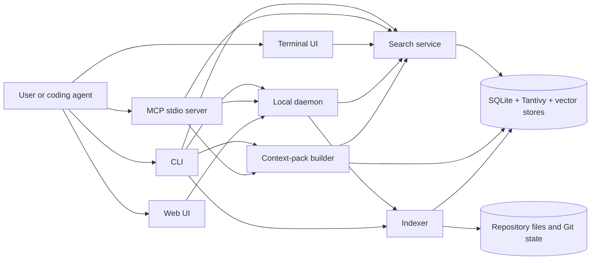

# ivygrep architecture

This document explains current repository structure and runtime behavior. It is
written for contributors who need to change indexing, retrieval, context packs,
or client integrations without breaking storage or protocol contracts.

Source code remains authoritative. Public behavior belongs in tests and CLI
help; this document records boundaries and invariants that are easy to miss when
reading one module at a time.

## Design constraints

ivygrep is built around six constraints:

1. **Repository data stays local.** Source, queries, indexes, embeddings, and
   results are processed on the user's machine. Neural profiles may download
   pinned model assets on first use.
2. **Lexical search becomes usable first.** A fresh index commits searchable
   text before optional hash and neural vector enhancement finishes.
3. **Results are bounded and inspectable.** Search limits candidate work.
   Context packs enforce a token budget and explain why each item was selected.
4. **Index updates preserve the last healthy state.** Fresh rebuilds use staging
   artifacts. Metadata and snapshots become authoritative only after stores
   commit successfully.
5. **Git worktrees reuse data without leaking base content.** A worktree reads
   its repository's base index plus a small overlay of changes and tombstones.
6. **Clients share contracts, not one oversized executor.** CLI, daemon, MCP,
   TUI, and Web reuse search options and aggregation while retaining their own
   lifecycle, caching, progress, and cancellation behavior.

## Runtime map



CLI and MCP can use local execution paths when daemon routing is unavailable or
inappropriate. Daemon adds watchers, shared caches, background jobs, and Web
serving; it is not required for every read path.

## Entry points and client surfaces

| Surface | Primary code | Responsibility |
| --- | --- | --- |
| Binary entry | `src/main.rs`, `src/cli.rs` | Parse commands, choose daemon or local execution, format output |
| Daemon | `src/daemon.rs`, `src/ipc.rs`, `src/jobs.rs` | Watch workspaces, schedule jobs, cache search state, serve IPC |
| MCP | `src/mcp.rs` | Expose `ig_search` and `ig_status` over JSON-RPC stdio |
| TUI | `src/tui.rs` | Interactive search, navigation, and file preview |
| Web server | `src/web.rs` | Serve embedded frontend assets and authenticated local APIs |
| Web frontend | `web/src/` | Search, context, tree, and file-viewer interactions |
| Agent setup | `src/agent.rs` | Configure supported clients and verify one real MCP search |

Cargo builds one binary, `ig`. Default features include local neural retrieval.
`--no-default-features` produces a hash-only build. Platform features select
Accelerate, Metal, or CUDA support where available.

`build.rs` embeds `web/dist` into the binary. Frontend source changes therefore
require a deterministic `pnpm -C web build` and committed generated assets.

## Workspace identity and data location

`Workspace::resolve` canonicalizes the requested path, discovers its repository
root when applicable, and derives a stable workspace identifier. Indexes live
under:

```text
$IVYGREP_HOME/indexes/<workspace-id>/
```

Without `IVYGREP_HOME`, ivygrep uses `$XDG_DATA_HOME/ivygrep` or
`~/.local/share/ivygrep`. On Unix, ivygrep-owned index directories are restricted
to mode `0700` because stored chunks can contain private source text.

Git worktrees share a repository identifier. A secondary worktree records the
main worktree's index directory as its base and stores only divergent state in
its own index directory.

## Index lifecycle

### Initial indexing

1. Resolve workspace and acquire its index lock.
2. Inspect index health and stored format version.
3. Walk indexable files while applying Git ignore rules unless explicitly
   disabled.
4. Build a flat Merkle snapshot of relative paths and file fingerprints.
5. Send files through a bounded scanner/chunker producer.
6. Parse supported languages with Tree-sitter or a bounded text fallback.
7. Extract symbols, imports, documentation relationships, tests, configuration,
   and unresolved dependency records.
8. Persist lexical documents and metadata to staging stores.
9. Commit SQLite and Tantivy, validate staged artifacts, then promote them.
10. Write workspace metadata, generation, format version, and Merkle snapshot.
11. Schedule hash and neural vector enhancement when configured.

Fresh indexing uses staging because SQLite, Tantivy, and vector stores cannot be
committed as one cross-store transaction. Promotion keeps rollback artifacts
until the new set is complete. A failed rebuild leaves the previous index
queryable.

### Incremental indexing

The Merkle snapshot compares current file fingerprints with the last committed
state. Its diff contains added or modified paths plus deleted paths. Incremental
updates replace affected chunks, graph edges, symbols, lexical documents, and
vector keys inside bounded transactions.

Watcher events use a targeted refresh only when path-level reconciliation is
safe. New directories, ignore-file changes, uncertain Git state, and similar
cases fall back to a full walk. A clean Git workspace whose recorded repository
state still matches can return without scanning every file.

Hash and neural vector deletion journals prevent stale embeddings from becoming
visible when another store fails. Merkle state is saved only after committed
stores and metadata agree.

## On-disk stores

| Artifact | Purpose |
| --- | --- |
| `workspace.json` | Root, watch intent, timestamps, and index generation |
| `metadata.sqlite3` | Chunk text and metadata, symbols, graph edges, unresolved dependencies, statistics |
| `tantivy/` | BM25, path, signature, language, kind, and trigram postings |
| `vectors.usearch` | Lightweight hash-vector index |
| `vectors_neural.usearch` | Learned neural-vector index |
| `neural_profile` and model identity metadata | Vector compatibility contract |
| `merkle_snapshot.json`, `merkle_snapshot.verified` | Last committed path fingerprints and aggregate root hash; the sidecar records the size and mtime of the last snapshot that parsed successfully so health checks skip re-parsing it |
| `job.json`, locks, progress files | Index, enhancement, and watcher coordination |

SQLite stores compressed chunk text when compression is useful. Reads use a
fallible decompression path with a 32 MiB output limit. Corrupt or oversized data
returns a contextual error instead of being treated as source text.

Tantivy is the lexical candidate store. SQLite remains authoritative for rich
chunk metadata and graph relationships. USearch stores F16 vectors and validates
headers, dimensions, and file bounds before native loading. Callers open every
vector store with an explicit `VectorTier`: the hash tier uses a sparse HNSW
graph for cheap background builds, and the neural tier keeps USearch quality
defaults. Vector shape cannot select the tier because the default neural profile
shares the hash store's 256-dimensional F16 layout.

The current on-disk format version is defined by `INDEX_FORMAT_VERSION` in
`src/workspace.rs`. Incompatible schema, chunking, or vector-identity changes
must bump it and provide rebuild or migration behavior.

Format v25 refreshes Python and Objective-C dependency facts through a one-time
full index rebuild, including unchanged files. This is not a graph-only migration;
existing indexes pay the normal indexing and subsequent vector-enhancement costs.

## Search pipeline

### Workspace selection

`src/search_service.rs` resolves one workspace or all registered workspaces and
aggregates results in deterministic score and path order. One broken workspace
produces a warning alongside valid hits. If every selected workspace fails, the
request returns an error rather than an empty result.

### Per-workspace execution

`SearchContext` opens compatible SQLite, Tantivy, and vector stores for one
workspace. Worktree contexts combine base and overlay stores while respecting
tombstones and shadowed paths.

`src/search_routing.rs` classifies query shape and assigns bounded candidate
budgets. Relevant signals include exact identifiers, literals, paths, natural
language, code-like syntax, note-like results, filters, and stored vector
availability.

`src/search_execution.rs` coordinates applicable retrieval passes:

- exact substring or regex candidates
- Tantivy BM25 over text, paths, signatures, and trigrams
- exact and inferred symbol candidates
- lightweight hash-vector ANN
- neural ANN when routing requests it and compatible vectors exist
- bounded memory probes for qualifying note-heavy implicit questions

Neural retrieval is conditional. Lexical confidence can make it unnecessary,
and lexical results remain available while neural vectors are incomplete.
`--force-neural` requires compatible persisted neural vectors and makes neural
execution observable in structured output.

### Fusion and presentation

`src/search_fusion.rs` combines candidates, source provenance, path and role
signals, literal coverage, and deterministic reranking. Fusion remains one
module because ordering and score interactions form one relevance contract.

`src/search_presentation.rs` selects representative spans, loads source text,
and builds explanations. Output records source signals and whether neural
retrieval was requested and executed.

Literal, regex, symbol, and caller commands have specialized paths where their
contracts differ from hybrid semantic search. They still reuse workspace,
filtering, grouping, and output types where appropriate.

Symbol rows (`symbols` in SQLite) store the case-folded lookup key, the
exact-case definition `name` when it differs from that key, and an optional
enclosing `owner` (class, impl, struct, module, or Go receiver); language and
kind are read from the joined chunk row, and a `chunk_key` index keeps file
removal proportional to the file's own symbols. Names come
from the Tree-sitter capture at chunk time; the line heuristic is only a
fallback for languages without a grammar, and continuation windows never
register symbols. Qualified lookups (`Owner.method`, `Owner::method`,
`Owner#method`, `Owner->method`) filter by owner, preferring exact-case matches
and falling back to the bare name; reference and caller scans are restricted
to the languages that define the symbol. Adding these columns bumped the index
format to v22.

Format v23 rebuilds existing indexes so unchanged Swift and Objective-C files
receive corrected structural chunks and parser-derived symbol names/owners.
This uses the normal full-index rebuild path, including vector regeneration;
there is no parser-specific partial migration.

Reference searches use indexed identifier candidates, then verify source syntax.
`--refs` includes non-call uses such as callbacks and function values; `--callers`
returns chunks containing calls. Whitespace, newlines, and generic arguments do
not need to be adjacent to the name. Tree-sitter excludes declaration names,
comments, and literal text; files without a usable parse use quote/comment
masking and a conservative declaration/call heuristic. Qualified references
match the immediate textual receiver name (ignoring scoped generic arguments),
not an inferred receiver type. This is best-effort syntax lookup, not compiler
resolution of imports, aliases, overloads, or shadowed bindings. Bounded requests
widen indexed candidate batches after
rejected matches, up to 25,000 chunks. CLI `--no-limit` retains its 50,000-candidate
ceiling; unbounded API requests (`limit: None`) scan all indexed literal candidates.
Each candidate file is parsed at most once per request with the chunker's 100 ms
parse budget.

## Context-pack pipeline

Context packs answer a different question from ranked search: which bounded set
of evidence helps an agent implement a task safely?

1. `src/context_input.rs` parses task text, explicit paths, stack traces, Git
   changes since a base, staged changes, dirty files, and untracked files.
2. Search finds primary implementations and task anchors.
3. `src/context_graph.rs` expands bounded relationships for definitions,
   references, callers, dependencies, dependents, tests, configuration,
   documentation, and recent co-change.
4. `src/context.rs` assigns evidence roles, removes redundant spans, balances
   primary and supporting files, and trims rendered output to the requested
   token budget.
5. Markdown and JSON output include paths, line ranges, roles, reasons, signals,
   change coverage, and budget use.

Dependency extraction is deliberately bounded. Unresolved imports are stored so
later file or manifest changes can resolve them incrementally. Missing an edge
does not prove no relationship exists.

Python imports and Objective-C quoted local `#import`/`#include` directives are
extracted from parsed syntax. Strings, docstrings, and comments do not create
dependency facts; Objective-C++ also excludes directives inside C++ raw strings.

## Worktree overlays

A Git worktree does not copy its repository's complete index. It uses:

- base workspace SQLite, Tantivy, and vectors for unchanged content
- `overlay.sqlite3` for divergent chunks and tombstones
- `overlay_tantivy/` for divergent lexical documents
- `overlay_vectors.usearch` for divergent hash vectors
- `base_ref.json` to record base generation and identity

Search merges base and overlay results, hides deleted or shadowed base paths, and
rejects stale or malformed overlay references that could expose content absent
from the active worktree. Base generation changes trigger reconciliation before
overlay content is trusted.

## Daemon, watchers, and background work

Daemon owns long-lived state that should not be recreated for every query:

- workspace watchers and adaptive debounce
- bounded indexing and enhancement jobs
- reusable search contexts
- query-result and neural-query-vector caches
- Web server sessions
- status, progress, and repair information

Watchers coalesce bursts and cap continuous-event starvation. Successful changes
invalidate only cache entries involving affected workspaces. No-op indexing
preserves valid cache entries.

Watcher health is the daemon's job, not the client's. At startup and every 30
seconds a supervisor registers a watcher for each enabled, indexed workspace
that has none; a registration that fails (inotify limits, a missing root) is
recorded in the workspace job ledger and retried with exponential backoff (30 s
doubling to 15 min). The watcher heartbeat re-creates its ledger record when an
index rebuild wiped `job.json`, so a running watcher never reads as offline. A
client that sees `watch_enabled` without `watcher_alive` sends `EnsureWatcher`;
the daemon answers immediately and registers in the background. Clients only
restart the daemon on a protocol version mismatch.

Search responses never wait on background enhancement bookkeeping. After the
hits are computed, the daemon schedules a blocking task that checks whether
hash or neural enhancement is needed and triggers the worker, at most once per
workspace and mode every ten seconds.

Heavy work is bounded by a CPU-permit semaphore sized to the core count. Index,
search, and watcher tasks take their per-workspace lease on the blocking pool
first and only then a CPU permit, so requests parked behind an exclusive index
lease never pin CPU capacity that other workspaces could use. Concurrent `Index`
requests for one workspace coalesce: the first request leads, identical requests
await its response, and a request that waited while the index generation
advanced skips the redundant rescan.

`ig --doctor` checks workspace health and can repair stale daemon state or broken
indexes. Status distinguishes lexical readiness, hash coverage, neural coverage,
active jobs, stalled work, watcher health, and compaction recommendations.

## Protocols and compatibility

### Daemon IPC

Daemon uses a versioned JSON-line request envelope. Protocol version 6 added
request IDs and explicit cancellation for hybrid, literal, and regex searches;
version 7 adds the fire-and-forget `StartIndex` request (answered with
`IndexStarted`) and the `index_in_flight` runtime-status field. Cancellation
also removes queued searches from daemon CPU backpressure. Existing requests
cover version/status, indexing, Web startup, workspace removal, watcher
recovery (`EnsureWatcher`), restart, progress, and structured errors. A client that reaches a daemon speaking an
older protocol (for example a development build with the same build version)
gets a structured version error from the `Version` probe and restarts it.

Cancellation acknowledgements for active searches are sent after registered work
has stopped. Pre-registration cancellations use bounded tombstones so reordered
IPC connections cannot revive stale searches.

Every search also carries a server-side cancellation token. The connection
handler races the search against the client stream reaching EOF and cancels
abandoned work on disconnect; CLI and MCP searches send request IDs and issue
`CancelSearch` when they time out or drop the request. A per-request deadline
(`IVYGREP_SEARCH_DEADLINE_SECS`, default 60 s, `0` disables) cancels long
searches and returns the hits gathered so far with a `warnings` entry.

`warnings` on search results is additive and omitted when empty, preserving
compatibility with older response readers. Unsupported protocol versions and
stale daemon build versions fail explicitly.

Unix uses a mode-`0600` local socket plus peer-UID checks. Windows uses a
loopback TCP endpoint protected by a per-daemon token. Request sizes and active
connections are bounded.

### MCP

MCP uses JSON-RPC 2.0 over stdio and accepts newline-delimited or
`Content-Length` framing. It exposes:

- `ig_search` for hybrid, literal, regex, symbol, caller, and context-pack work
- `ig_status` for indexed-workspace and runtime state

MCP can auto-index a requested workspace, so search is idempotent but not
read-only. A first index is never awaited for its full duration: `ig_search`
enqueues it on the daemon with `StartIndex` (coalesced with any in-flight run
for that workspace), polls `RuntimeStatus.index_in_flight` for at most
`IVYGREP_MCP_INDEX_WAIT_SECS` (default 20 s), and otherwise returns a non-error
`status: indexing` payload (`progress`, `elapsed_secs`, `retry_after_secs`) read
from the shared job ledger and progress file. The MCP process indexes in-process
only when no daemon is reachable, so it never duplicates a run the daemon owns.
Tool failures return structured MCP errors. Handler panics are isolated instead
of terminating the session.

### Web

Daemon serves embedded assets and APIs for status, search, streaming search,
file reads, editor launch, and workspace trees. File operations enforce tracked
workspace containment.

Loopback is default. Non-loopback mode uses a generated session token, Host and
authentication checks, Content Security Policy, security headers, and request,
header, file, and concurrency limits. Transport is still plain HTTP; remote use
requires a trusted network or encrypted tunnel.

## Embeddings and build profiles

Every index can use lightweight hash vectors. Neural-enabled builds also support
pinned model-backed profiles:

- default 256-dimensional static retrieval profile
- Model2Vec PotionCode profile
- optional 384-dimensional Candle transformer profiles
- platform acceleration through Accelerate, Metal, or CUDA builds

Profile name, model revision, dimensions, pooling, normalization, and weight
digest form the neural identity. A mismatch prevents incompatible vectors from
being reused. Model-backed profiles download pinned assets on first use unless
the Hugging Face cache is already populated.

## Module ownership

| Concern | Modules |
| --- | --- |
| Configuration and paths | `config.rs`, `workspace.rs` |
| Walking and chunking | `walker.rs`, `chunking.rs`, `text.rs` |
| Index orchestration | `indexer.rs` |
| Index storage concerns | `src/indexer/compression.rs`, `src/indexer/git_state.rs`, `src/indexer/resources.rs`, `src/indexer/staging.rs`, `src/indexer/storage.rs` |
| Change detection | `merkle.rs` |
| Embeddings and vectors | `embedding.rs`, `vector_store.rs`, `vector_store/` |
| Hybrid search | `search.rs`, `search_execution.rs`, `search_fusion.rs`, `search_presentation.rs`, `search_routing.rs`, `search_service.rs` |
| Exact and symbol search | `regex_search.rs`, `symbols.rs` |
| Context packs | `context_input.rs`, `context_graph.rs`, `context.rs` |
| Runtime surfaces | `cli.rs`, `daemon.rs`, `mcp.rs`, `tui.rs`, `web.rs`, `protocol.rs`, `ipc.rs` |
| Frontend | `web/src/main.ts` plus focused API, type, rendering, viewer, icon, clipboard, and UI modules |

Several orchestration modules remain large because they encode coupled ranking,
graph, daemon, or workspace invariants. Split them only around a tested behavior
boundary. File size alone is not sufficient reason for a refactor.

## Correctness and evidence gates

Use the narrowest relevant check while iterating, then run repository gates:

```bash
./test.sh --quick
./test.sh
./scripts/e2e_all.sh --binary target/release/ig
./bench.sh
```

Coverage includes fresh and incremental indexing, worktree overlays, storage
migrations, corrupt artifacts, retrieval quality, deterministic ranking, daemon
recovery, MCP sessions, Web APIs, browser behavior, installer artifacts, and
release workflows. Neural backend acceptance separately forces neural retrieval
and requires `neural_executed: true`; model caches can be pre-populated for
offline checks.

Performance and relevance changes need comparable before/after evidence. Keep
hardware, corpus, model, build profile, query set, warmup, and concurrency fixed.
Synthetic scale measurements are not semantic-quality evidence.

## Safe change rules

- Treat index format, neural identity, and daemon protocol as compatibility
  contracts.
- Preserve lexical availability when changing enhancement or model loading.
- Preserve staging, journaling, and commit order when touching persistence.
- Test base, overlay, deletion, and stale-generation behavior for worktree work.
- Keep partial-workspace warnings visible across CLI, daemon, MCP, TUI, and Web.
- Measure relevance before changing routing, fusion, candidate limits, or score
  ordering.
- Validate generated `web/dist` bytes whenever frontend source changes.
- Update this document when module ownership or a cross-store invariant changes.
