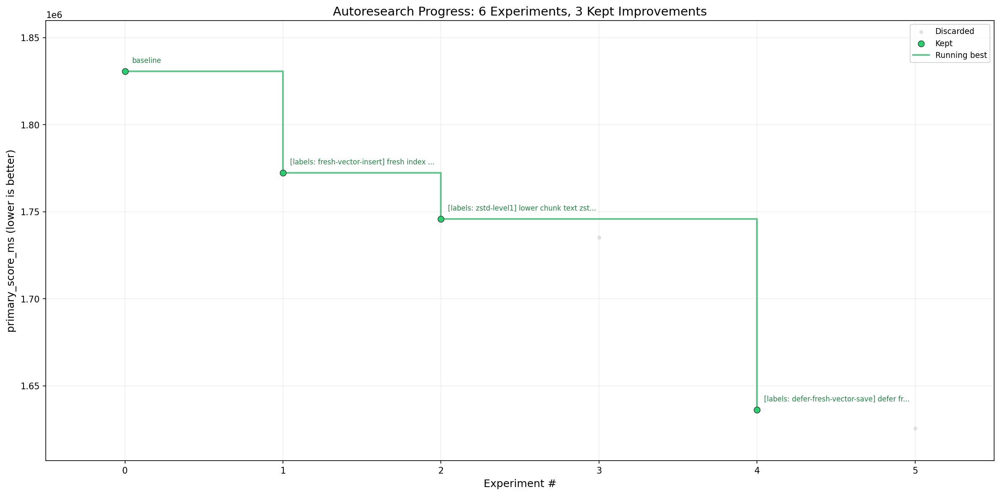

# Linux Kernel Autoresearch Benchmark - 2026-05-13

This run optimized ivygrep cold indexing and query latency against a shallow Linux kernel checkout at `/home/bruno/githubworkspace/linux`.

## Benchmark

- Host: Linux workstation, 32 CPUs, 124120 MB RAM.
- Kernel checkout: commit `1d5dcaa3b`, 93493 indexed files.
- Harness: `python3 scripts/bench_linux_kernel.py --kernel /home/bruno/githubworkspace/linux --samples 5`.
- Metric: `primary_score_ms = cold_index_ms + cold_query_ms + hot_query_p95_ms`.
- Guard: `cargo test --locked`.
- Direction: lower is better.

## Result

| Metric | Baseline | Best retained | Delta |
| --- | ---: | ---: | ---: |
| Primary score | 1830638.41 ms | 1636222.96 ms | -194415.45 ms (-10.62%) |
| Cold index | - | 1635412.43 ms | - |
| Cold query | - | 402.19 ms | - |
| Hot query p95 | - | 408.33 ms | - |
| Hot query median | - | 405.19 ms | - |
| Literal hot p95 | - | 392.11 ms | - |
| Literal hot median | - | 380.26 ms | - |
| Indexed files | - | 93493 | - |
| Total chunks | - | 4666431 | - |
| Index size | - | 6419.25 MB | - |

Cold, hot, and literal queries each returned 20 hits in the best retained run.

## Experiments

| Iteration | Commit | Status | Primary score | Delta | Notes |
| --- | --- | --- | ---: | ---: | --- |
| 0 | `e1c84fc` | baseline | 1830638.41 ms | 0.00 ms | Baseline verify with 5 samples on Linux checkout. |
| 1 | `5a1a28f` | keep | 1772337.81 ms | -58300.60 ms | Fresh index vector writes reserve per batch and add without duplicate probes. |
| 2 | `7c8c23e` | keep | 1745803.23 ms | -26534.58 ms | Lower chunk text zstd compression level from 3 to 1. |
| 3 | `30e92af` | discard | 1735266.31 ms | -10536.92 ms | Reusing zstd bulk compressor was only 0.60% faster than retained best, so reverted. |
| 4 | `ab53180` | keep | 1636222.96 ms | -109580.27 ms | Defer fresh-index vector store saves until final commit to avoid rewriting whole vector file during bulk ingest. |
| 5 | `10a4e3d` | discard | 1625635.44 ms | -10587.51 ms | Raising bulk commit interval to 100k was only 0.65% faster than retained best, so reverted. |

## Retained Changes

- Added `scripts/bench_linux_kernel.py` to measure release build, forced cold index, cold query, hot semantic queries, and hot literal queries.
- Changed chunk text compression from zstd level 3 to level 1.
- Reserved vector capacity during fresh indexing.
- Used unchecked vector insert for fresh indexes where duplicate keys cannot exist yet.
- Skipped periodic vector-file saves during fresh full indexing; final vector persistence still runs before index metadata is marked complete.
- Extended `indexes_simple_repo` to assert final index metadata and vector file persistence.

## Validation

- `python3 -m py_compile scripts/bench_linux_kernel.py`
- `python3 scripts/bench_linux_kernel.py --help`
- `python3 scripts/bench_linux_kernel.py --kernel /home/bruno/githubworkspace/linux --samples 5`
- `cargo fmt --check`
- `cargo clippy --all-targets -- -D warnings`
- `cargo test --locked`
- `cargo test --locked indexer::tests::`
