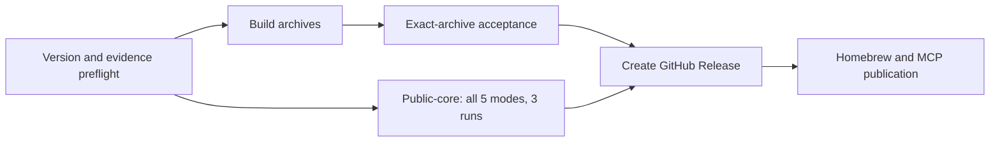

# Releasing ivygrep

A release tag starts the build pipeline; it must not be used as a substitute
for finishing review or checking the intended source revision. A preparation
PR is not a published release.

## Before tagging

1. Land the intended fixes and require their terminal CI and platform results
   before freezing source.
2. Keep `Cargo.toml`, the root `Cargo.lock` package, both plugin manifests, and
   the versioned changelog section consistent. Update the planned release date
   if publication moves to a different day.
3. Build the exact final source and regenerate neural-aware self-repository
   evidence. Any later source/Cargo/vendor change requires regeneration:

   ```bash
   cargo build --locked --release --bin ig
   uv run scripts/run_current_head_benchmark.py \
     --binary target/release/ig --require-neural
   uv run scripts/render_evidence_dashboard.py
   uv run scripts/check_release_readiness.py --tag vX.Y.Z
   ```

4. Commit the evidence, rerun checks, and inspect the final diff. Do not copy
   an old report and edit its version or source checksum. A passed preflight
   validates the checked-in evidence; it does not replace the fresh public
   retrieval matrix or exact-archive acceptance.
5. Create and push the release tag only after publication is authorized.

## Publication gates

The tag workflow checks version identity, nonempty release notes, and
source-matched neural evidence before spending time on archive builds.



GitHub Release creation requires both archive acceptance and the public-core
gate. Tag pushes run the reusable public matrix once, as a gate before
publication; scheduled and manual evaluations use the same matrix. The passing
matrix JSON and HTML ship with the initial release assets. Missing evidence
prevents publication.

After the GitHub Release exists, `release.yml` publishes MCP Registry metadata
(`server.json`, through GitHub OIDC) and updates the formula in
`bvolpato/homebrew-tap` (requires the `HOMEBREW_TAP_TOKEN` secret). The tag
workflow does not publish WinGet manifests or crates.io packages.

If a gate fails, diagnose and fix it without weakening the thresholds or
marking a skipped backend as tested. Do not move an already published tag to
different source. Manual public-evidence backfill remains available for an
existing release, but it is not the normal publication gate.

## Package and hardware scope

`publish-crates.yml` is a manual workflow. It checks exact tag identity and
publishes vendored forks in dependency order. Publish any new or bumped fork
before the root crate version that requires it. GitHub release archives do not
prove that crates.io publication succeeded.

CUDA compilation or CPU fallback is not GPU execution evidence. Do not advertise
CUDA execution without a result from a CUDA device or runner. The strict Metal
job must name the actual Metal backend. QEMU/musl, native Windows, and native
ARM checks should refer to the final source, not an earlier release binary.
